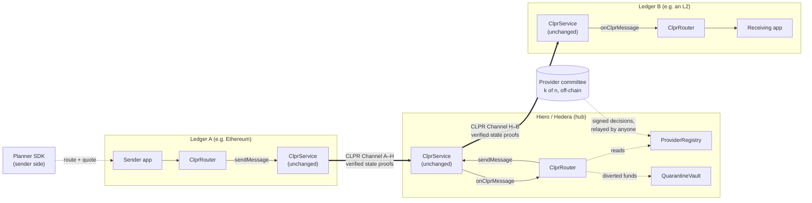
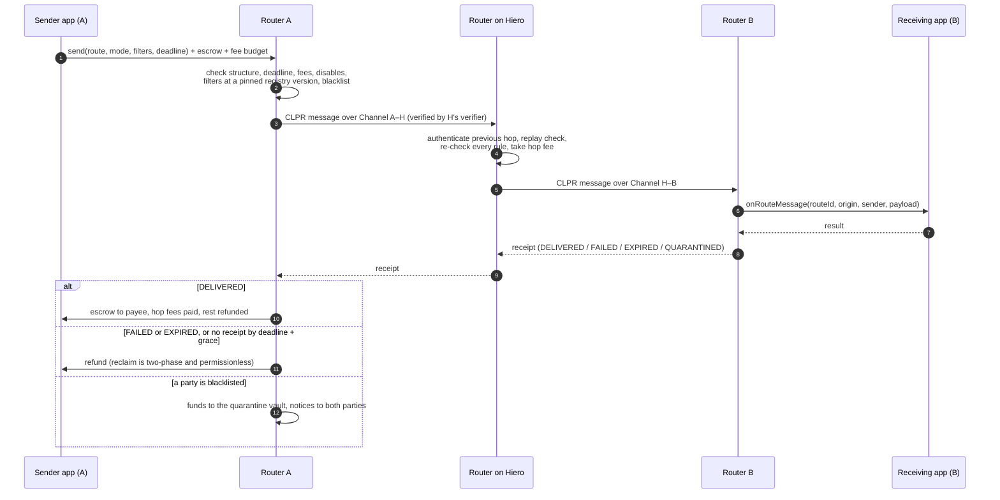
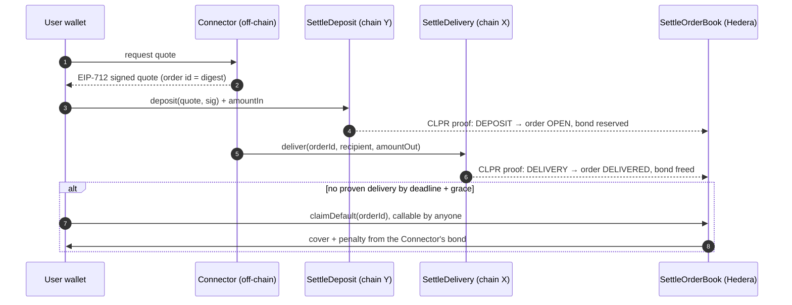
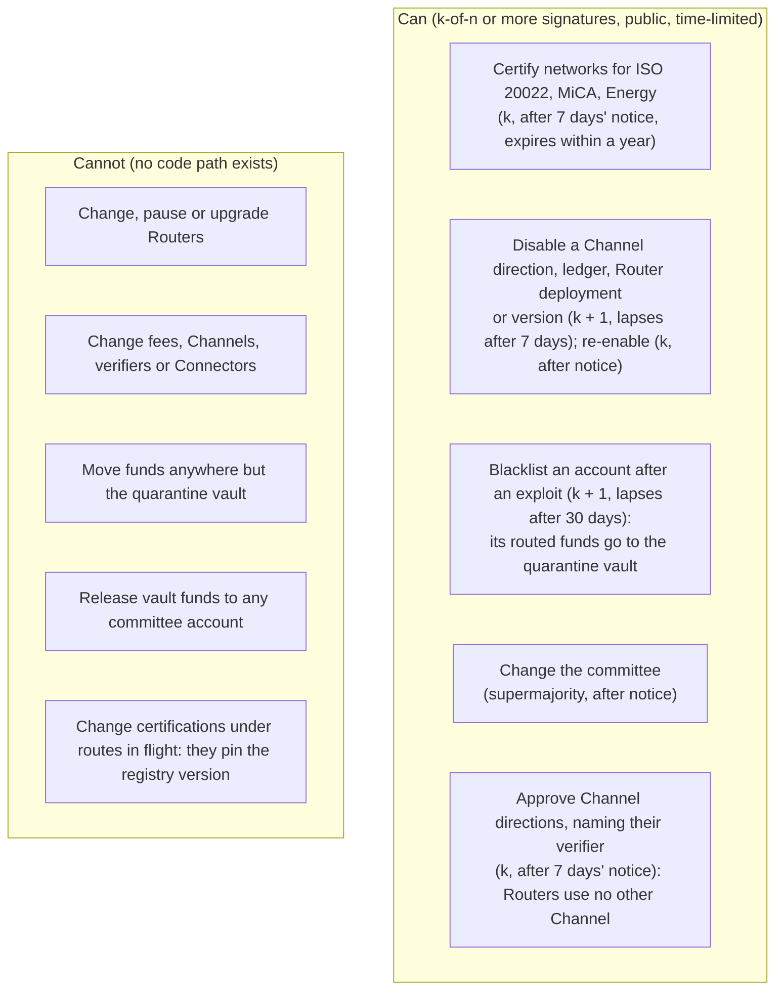

<p align="center">
  <a href="https://coldai.org">
    <picture>
      <source media="(prefers-color-scheme: dark)" srcset=".github/assets/coldai-logo-white.png">
      
    </picture>
  </a>
</p>

<h1 align="center">CLPRouter</h1>

<p align="center">
  <strong>Multi-hop routing for CLPR: one Channel per ledger to a hub, and any ledger can reach any other.</strong><br>
  Messages and escrowed payments forwarded hop by hop over verified CLPR Channels, with end-to-end receipts,
  refunds, and cheapest / fastest / most reliable / greenest routes under ISO&nbsp;20022, MiCA and Energy filters.
</p>

<p align="center">
  <a href="https://github.com/ColdAI-org/clprouter/actions/workflows/ci.yml"></a>
  <a href="https://github.com/ColdAI-org/clprouter/actions/workflows/codeql.yml"></a>
  <a href="https://github.com/ColdAI-org/clprouter/actions/workflows/nightly-e2e.yml"></a>
  
  <br>
  <a href="LICENSE"></a>
  
  
  <a href="deployments/README.md"></a>
  
  
</p>

---

[CLPR](https://github.com/LFDT-CLPR) is the cross-ledger protocol hosted by LF Decentralized Trust in which two ledgers
verify each other's state proofs directly: no bridge validators, no pooled liquidity. A CLPR Channel joins exactly
two ledgers. **CLPRouter is an application on top of CLPR, with no protocol change, that turns those pairwise
Channels into a network.** It forwards a routed message hop by hop, re-checks the sender's rules on-chain at every
hop, returns a receipt to the origin and settles or refunds the sender's escrow there. Every hop is verified by its
own Channel's CLPR verifier; CLPRouter adds no new party to the data path.

> **Pre-release.** Testnets and local networks only. Two internal audits, every High, Medium and Low finding fixed;
> no external audit yet. Do not route real value. See [Security model and audit status](#security-model-and-audit-status).

## Contents

[What works today](#what-works-today-on-public-testnets) ·
[Architecture](#architecture) ·
[A routed message](#lifecycle-of-a-routed-message) ·
[Settle on Hedera](#settle-on-hedera) ·
[The provider](#the-provider-narrow-powers-enforced-on-chain) ·
[Modes and filters](#modes-and-filters) ·
[Why CLPRouter](#why-clprouter) ·
[Quick start](#quick-start) ·
[Security](#security-model-and-audit-status) ·
[Status](#status) ·
[Roadmap](#roadmap) ·
[For the LFDT CLPR team](#for-the-lfdt-clpr-team) ·
[Contributing](#contributing-and-governance)

## What works today on public testnets

Everything below is on Ethereum Sepolia (`eip155:11155111`) and Hedera testnet (`eip155:296`), next to the
unchanged reference CLPR Service at `0xa6db474e3047c3d43b10a4ff7abad547d89982b9` on both. The full record, with
every address, code hash, transaction, gas figure and cost, is in [`deployments/`](deployments/README.md)
([`sepolia.json`](deployments/sepolia.json), [`hedera-testnet.json`](deployments/hedera-testnet.json)). All 22
Sepolia and 54 Hedera transactions recorded there were re-checked against the chains on 5 October 2026.

| What | Proof |
| --- | --- |
| **Canonical CREATE2 deployment, same addresses on both chains.** Registry, vault, `ClprRouterDeployer` and the five Router libraries share one address on each network; each ledger's Router sits at its canonical CREATE2 address. Sources of the Router stack verified on Sourcify. | Router deploy: [Sepolia `0x9bb34fe0…`](https://sepolia.etherscan.io/tx/0x9bb34fe0a1a782c6c1eb4035cc8e388c340aa3fea615016746a5c7e51324adaa) · [Hedera `0xb36e281b…`](https://hashscan.io/testnet/transaction/0xb36e281bd777d16965efd362fcd92e8639ee8e0765e02625a95fcd20ad6cdae2). Routers: [Sepolia `0x3Ec8a28f…A653`](https://sepolia.etherscan.io/address/0x3Ec8a28f6AD20FE1070819f56B29be120700A653) · [Hedera `0xF398F961…3E5F`](https://hashscan.io/testnet/contract/0.0.10806974) |
| **A CLPR Channel Sepolia ↔ Hedera, verified on Hedera by the CLPR repo's `EthMainnetVerifier`** (Ethereum sync-committee light client), reused byte-identical from the submodule. | Hedera `completeChannel`: [`0x28556511…`](https://hashscan.io/testnet/transaction/0x285565114acef4b37592e9ac115460bbfcabd547936e44fd515ed9919132a3d9) (788,546 gas). Verifier: [`0.0.10796650`](https://hashscan.io/testnet/contract/0.0.10796650) |
| **Engineering finding: Hedera's contract trace-size cap.** Opening that Channel in one transaction (67,364 B of call data) failed with `INSUFFICIENT_GAS` at every gas limit from 5.6M to 15M, always at 4,062,470 gas used. The cause is the consensus node's `contracts.maxSerializedTraceDataBytes` (262,144 B), not gas. | Failed attempts: [`0x6f0285ff…`](https://hashscan.io/testnet/transaction/0x6f0285ff22c877035165e025a01350fc7077fffe8bbb2a0f9d7fbebaed99781e) (5.6M limit) · [`0x7dc546cd…`](https://hashscan.io/testnet/transaction/0x7dc546cdba0c66c0c0a5bb18014c60786071c69045489a4a2e8256826542cdf3) (15M limit). Write-up: [docs/lfdt/hedera-trace-cap.md](docs/lfdt/hedera-trace-cap.md) |
| **The fix: a staged-committee adapter.** [`StagedEthConfigVerifier`](script/deploy/StagedEthConfigVerifier.sol) stages the 512 keys in 16 chunks of 32, then opens the Channel with the 16 chunk roots and returns exactly what `EthMainnetVerifier.verifyConfig` returns (parity-tested); every bundle is still verified by `EthMainnetVerifier`. | First chunk: [`0xdf341d48…`](https://hashscan.io/testnet/transaction/0xdf341d4864af1506c95e52dde2aeb9659b9c06fc61e716b0d8be3cd0cb102ccd) (171,716 gas). Adapter: [`0.0.10841641`](https://hashscan.io/testnet/contract/0.0.10841641). Proposal: [docs/proposals/clpr-staged-eth-committee.md](docs/proposals/clpr-staged-eth-committee.md) |
| **A route Sepolia → Hedera, delivered.** `Router.send` on Sepolia; the Sepolia state proof (14,829 B) verified on Hedera by `EthMainnetVerifier`; the Hedera Router delivered the payload to the destination app and queued its `DELIVERED` receipt. | Send: [Sepolia `0x8a08f199…`](https://sepolia.etherscan.io/tx/0x8a08f19922f6a265f2900b218db01510c4dc21e50ed80b68ae8756faddff0d6c) · delivery `submitBundle`: [Hedera `0x1249ca90…`](https://hashscan.io/testnet/transaction/0x1249ca9040fb4c1f02e99ee656823393b223bf9f2bcba9d2a6cdb36344e1989b) (2,755,892 gas) · receipt `flush`: [Hedera `0xc843d6d4…`](https://hashscan.io/testnet/transaction/0xc843d6d4f6199b934fdf221a9192a69df015d1ada9d5c6b847dde61c37d4a7bb) |
| **Settle on Hedera contracts deployed.** `SettleOrderBook` on Hedera; `SettleDeposit` and `SettleDelivery` on Sepolia; a test Connector registered with a 5 HBAR bond. The reference Connector service returned a signed quote the order book accepts. | Order book: [`0x41374335…`](https://hashscan.io/testnet/transaction/0x41374335fbf43000d9f72ea81bbd1587587bb5e70320ca979a7db533e3b909b2) ([`0.0.10867905`](https://hashscan.io/testnet/contract/0.0.10867905)) · bond: [`0xeb4ddf75…`](https://hashscan.io/testnet/transaction/0xeb4ddf7534d3c6c7b30afe47cfd6a07bc3729c9f6e942e7d86709e8d6fbbfb4b) · Deposit: [Sepolia `0xf8df71b3…`](https://sepolia.etherscan.io/tx/0xf8df71b3fdb143044236c6ba77ace20c1c59cb6c29ec363b8ed24e9546c16330) · Delivery: [Sepolia `0x9a5239a3…`](https://sepolia.etherscan.io/tx/0x9a5239a3ffa2d5e032478b4777d6f2942a0a195bf973b11d61afaf4261e1aec5) |

**What is not done on testnet, plainly:** the `DELIVERED` receipt cannot travel back to Sepolia, because no Hiero
state-proof source exists yet (the Sepolia side of the Channel uses a test-only stub verifier that accepts no
bundles), so the origin route stays pending until `reclaim`. The Hedera Channel was opened for one Sepolia
sync-committee period; following the next committee needs the same staging on the rotation path (proposal above).
No real Settle order has run yet: the order book's Sepolia source becomes active on 6 October 2026 at 06:20 UTC
(after its one-day notice), the settle CLPR connector is not yet registered on Sepolia, and new Sepolia messages
need the Channel's next sync committee. Details: [deployments/README.md](deployments/README.md).

Total testnet spend: 0.0275 Sepolia ETH and about 75 HBAR (account balance difference), of which 48.1 HBAR went on
the five failed attempts that led to the trace-cap finding.

## Architecture

Every ledger runs the unchanged CLPR Service and the same small set of CLPRouter contracts. Hiero is the natural hub:
each ledger opens one Channel to it, and routes go spoke → hub → spoke.



| Component | What it is |
| --- | --- |
| [`ClprRouter`](src/ClprRouter.sol) | One per ledger, deployed at a canonical CREATE2 address. Immutable: no admin key, no pause, no upgrade. 23,175 B runtime (EIP-170 limit 24,576 B). |
| [`ProviderRegistry`](src/ProviderRegistry.sol) | Append-only, hash-chained register of k-of-n committee decisions: certifications, disables, blacklist. |
| [`QuarantineVault`](src/QuarantineVault.sol) | Per-ledger vault for funds diverted by the blacklist, with fixed release rules. |
| [`ClprRouterDeployer`](src/ClprRouterDeployer.sol) | Deploys each ledger's Router at its canonical address; every hop refuses non-canonical Routers. |
| [`src/settle/`](src/settle) | Settle on Hedera: `SettleOrderBook`, `SettleDeposit`, `SettleDelivery`. |
| [`proto/`](proto) | `ClprRouteEnvelope` / `ClprRouteReceipt` protobuf schema, with cross-checked Solidity and TypeScript codecs. |
| [`sdk/`](sdk) | TypeScript planner (k-shortest paths, five modes, filters, quotes), envelope builder, ISO&nbsp;20022 module, measured route data for 86 chains. |
| [`services/`](services) | Optional indexer, route status API, quote service, permissionless forward trigger; reference Settle Connector. |

## Lifecycle of a routed message



On the reference Solidity CLPR Service, a hop that forwards from inside delivery meets the Service's reentrancy lock;
the Router records the hop as pending and anyone completes it in the next transaction with `forward()` or `flush()`
(every check runs again). On a Service that allows sends during delivery, the hop goes out in the same transaction.

## Settle on Hedera

Pay on chain Y, be paid on chain X by a bonded **Connector**, with the guarantee held on Hedera. CLPR proofs only
need to flow **chain → Hedera**, so it works with the verifiers that exist today. If the Connector misses the deadline,
anyone can trigger the payout of cover plus penalty from its bond, on Hedera.
[Design, measurements and gaps](docs/settle-on-hedera.md).



Every order-book step fits one Hedera transaction (largest measured `submitBundle` with 5 deposits: 4,328,991 gas,
an estimated 26.7 % of the trace cap); relayers cap bundles to Hedera at 12 messages.

## The provider: narrow powers, enforced on-chain



The vault pays only the original sender, the original recipient, or a recovery address named by k + 1 members after
a public notice and a challenge window that every deposit gets in full. Worst case with compromised committee keys:
false filter labels, a weak Channel approved after a week's public notice, stopped routes, funds parked in the vault
until the committee is replaced. Full analysis: [threat model](docs/threat-model.md).

## Modes and filters

Route planning runs on the sender's side ([`sdk/`](sdk)); every hop re-checks the result on-chain, so a bad quote can
make a route fail but cannot redirect funds.

| Mode | Optimises |
| --- | --- |
| Cheapest | Total fees in one quote currency |
| Fastest | Expected (p90) time to delivery |
| Most reliable | Chance of on-time delivery at a trust floor, with a disjoint fallback route |
| Greenest | Estimated kgCO2e per message, from certified emissions figures |
| Balanced (default) | Weighted cost, time, reliability and carbon |

| Filter | Every ledger on the route, origin and destination included, must hold |
| --- | --- |
| ISO&nbsp;20022 | A committee certification for ISO 20022 messaging (pacs.008/009/002, camt.056/029, pacs.004 supported; the UETR travels end to end; payment messages encrypted to the destination institution, only hashes on-chain) |
| MiCA | A committee certification for MiCA |
| Energy | A committee certification with its emissions figure (µgCO2e per transaction) and source |

Filters combine with any mode (`fastest + ISO 20022`, `greenest + MiCA + Energy`) and with constraints: max hops,
deadline, fee cap and an optional on-chain trust floor. Evidence and draft decisions: [`registry-data/`](registry-data).

## Why CLPRouter

**Versus a full mesh of Channels.** Without a router, every pair of ledgers needs its own Channel and a verifier in
each direction: 100 ledgers means 4,950 pairs. With CLPRouter, one Channel per ledger to a hub is enough: 100 ledgers,
100 Channels. Forwarding, fee budgets, end-to-end receipts, deadlines and refunds are built once instead of in every
application.

**Compared with other interoperability designs** (factual differences, not a ranking):

| Design | How messages are trusted | Where CLPRouter differs |
| --- | --- | --- |
| Validator- or multisig-signed bridges | A separate signer set signs off on source-chain events | No extra signer set: each hop is accepted only if its CLPR Channel's verifier accepts the proof. The provider committee cannot create or alter messages. |
| Intent / solver networks | Solvers fill orders and are repaid after a settlement check | Settle on Hedera is intent-like, but the solver (Connector) posts an on-chain bond on Hedera and both payments are proven to Hedera with CLPR proofs; a missed deadline pays the user from the bond. |
| IBC | Light-client connections between pairs of chains | Closest in spirit. CLPR provides the pairwise verified Channels; CLPRouter adds multi-hop routing, route selection, compliance filters and escrow settlement on top, as an application. |
| Hosted messaging networks (CCIP-style) | The messaging network's own nodes and risk controls | CLPRouter is not a messaging network: it reuses CLPR for transport and verification and adds no off-chain party that messages depend on. Its services are optional conveniences. |

## Quick start

Prerequisites: [Foundry](https://getfoundry.sh) v1.5.1 (`foundryup -i v1.5.1`), Node.js 22.13 or later, pnpm and
jq.

```sh
git clone --recurse-submodules https://github.com/ColdAI-org/clprouter && cd clprouter

forge test --skip 'script/**'                # 384 contract tests in 25 suites: unit, fuzz, invariant, security, three-ledger
(cd sdk && pnpm install && pnpm test)        # 213 tests: planner, envelope codec, ISO 20022
forge build                                  # artefacts for the services' anvil integration test
(cd services && pnpm install && pnpm test)   # 175 tests: services, Settle Connector, anvil integration

make demo                  # three anvil chains, five routes A → B → C and back, summary table (about 9 minutes)
script/settle-e2e/run.sh   # Settle on Hedera on three anvil chains, four scenarios, with Hedera trace-size checks
```

`make demo` runs [`script/e2e/run.sh`](script/e2e/run.sh), which sends five routes and checks each outcome: delivered with escrow released, destination app
reverts (`FAILED`), edge disabled mid-route (`FAILED`), recipient blacklisted (`QUARANTINED`), deadline passed
(`EXPIRED`). Gas per transaction lands in `e2e-out/gas.tsv`. A route through a local Hiero network (Solo) is in
[`script/e2e-hiero/`](script/e2e-hiero). Reproducing the testnet deployment: [deployments/README.md](deployments/README.md#how-to-reproduce).
`make demo-docker` runs the same demo with only Docker installed, and `make help` lists the other targets (build,
coverage, gas snapshot, halmos, slither). To use the SDK in your own project, see [sdk/README.md](sdk/README.md#install).

Test counts were measured on this branch (`forge test --summary`, `pnpm test` in `sdk/` and `services/`). CI runs
the same suites on every push plus 10,000-run fuzzing, invariants, halmos proofs, coverage, a gas snapshot,
Slither and CodeQL ([engineering quality](docs/quality.md)); the three-chain e2e
runs nightly.

## Security model and audit status

- **No new trust in the data path.** Each hop is verified by its Channel's CLPR verifier. A route is as strong as its
  weakest hop, including the Router on each hop.
- **No operator.** Routers are immutable, have no admin key and cannot be paused. New versions deploy beside old ones;
  each envelope names the version every hop must run. Forwarding is permissionless.
- **Canonical Routers only.** Every Router a route names must sit at its ledger's canonical CREATE2 address, so every
  envelope on the wire was built by Router code.
- **A narrow provider role**, enforced by the contracts (above).

| Review | Scope | Result |
| --- | --- | --- |
| Internal review 1 | Router, codec, envelope ([`docs/audit/router-findings.md`](docs/audit/router-findings.md)) | 2 High, 5 Medium, 3 Low, all fixed with a regression test each; 6 informational (4 fixed, 1 partly, 1 acknowledged) |
| Internal review 2 | Registry and vault ([`docs/audit/registry-vault-findings.md`](docs/audit/registry-vault-findings.md)) | 2 High, 4 Medium, 2 Low, 2 Info; all fixed, each with a regression test |
| Re-review | Whole repository | In progress |
| External audit | — | **None yet.** Required before any mainnet use. |

Threat model: [docs/threat-model.md](docs/threat-model.md) (residual risks R1–R12, Settle on Hedera in section 8).
Auditor pack: [docs/audit-readiness.md](docs/audit-readiness.md). Report security problems privately as described
in [SECURITY.md](SECURITY.md), never in a public issue.

## Status

| | |
| --- | --- |
| Contracts, SDK, services | Built and tested; deployed on Sepolia and Hedera testnet ([record](deployments/README.md)) |
| Chain → Hedera | Live on testnet over `EthMainnetVerifier` for one sync-committee period; continuous operation needs staged rotation |
| Hedera → chain | Waits on a Hiero state-proof source (block-node `getStateProof`); runs on a test verifier in local tests only |
| Forwarding | On the reference CLPR Service each intermediate hop completes in a second, permissionless transaction |
| Settle on Hedera | Contracts and reference Connector deployed on testnet; no real order yet |
| Security | Two internal audits, every High, Medium and Low finding fixed; re-review in progress; no external audit |
| Provider | A real committee, its key ceremony and legal review of the quarantine vault are prerequisites for mainnet |

## Roadmap

| Next | Depends on |
| --- | --- |
| Staged sync-committee rotation, so a Hedera Channel over `EthMainnetVerifier` keeps running across periods | Upstream CLPR verifier change ([proposal](docs/proposals/clpr-staged-eth-committee.md)) or an adapter on the rotation path |
| Hiero → chain legs (receipts back to the origin, Hedera as a full hub) | A Hiero state-proof source for EVM storage slots |
| First real Settle order on testnet; payment provers for Bitcoin, XRPL, Stellar | Sepolia CLPR connector; per-chain payment parsing |
| One-transaction forwarding | A CLPR Service that allows `sendMessage` during application delivery |
| External audit, then a real provider committee with an HSM key ceremony | Funding and committee members |
| Phase 4: per-hop escrow and asset routing | — |

## For the LFDT CLPR team

- [Briefing for the CLPR maintainers](docs/lfdt/briefing.md): what we built and verified, three proposed upstream
  contributions, questions, and a 10-minute demo script.
- [Hedera trace-size cap](docs/lfdt/hedera-trace-cap.md): evidence, reproduction and impact on large-calldata CLPR
  verifiers on Hedera.
- [FAQ](docs/faq.md).

## Contributing and governance

Contributions are welcome under the DCO: see [CONTRIBUTING.md](CONTRIBUTING.md), [GOVERNANCE.md](GOVERNANCE.md) and
the [Code of Conduct](CODE_OF_CONDUCT.md). `lib/clpr-smart-contracts` stays unchanged: CLPRouter must keep working as
a plain CLPR application.

## License

[MIT](LICENSE) © 2026 ColdAI. CLPR itself, included as a submodule, is licensed separately under Apache-2.0 by
LF Decentralized Trust. CLPRouter is an independent project built on CLPR, maintained by ColdAI; it is not an
LF Decentralized Trust project.

<p align="center">
  <br>
  <a href="https://coldai.org">
    <picture>
      <source media="(prefers-color-scheme: dark)" srcset=".github/assets/coldai-logo-white.png">
      
    </picture>
  </a>
  <br>
  <sub>Built by <a href="https://coldai.org">ColdAI</a></sub>
</p>
