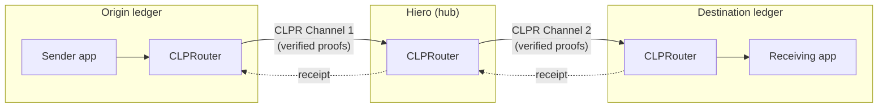
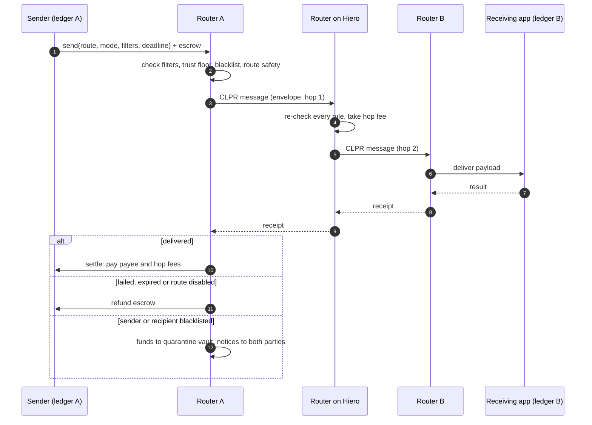
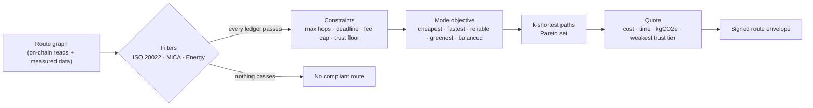
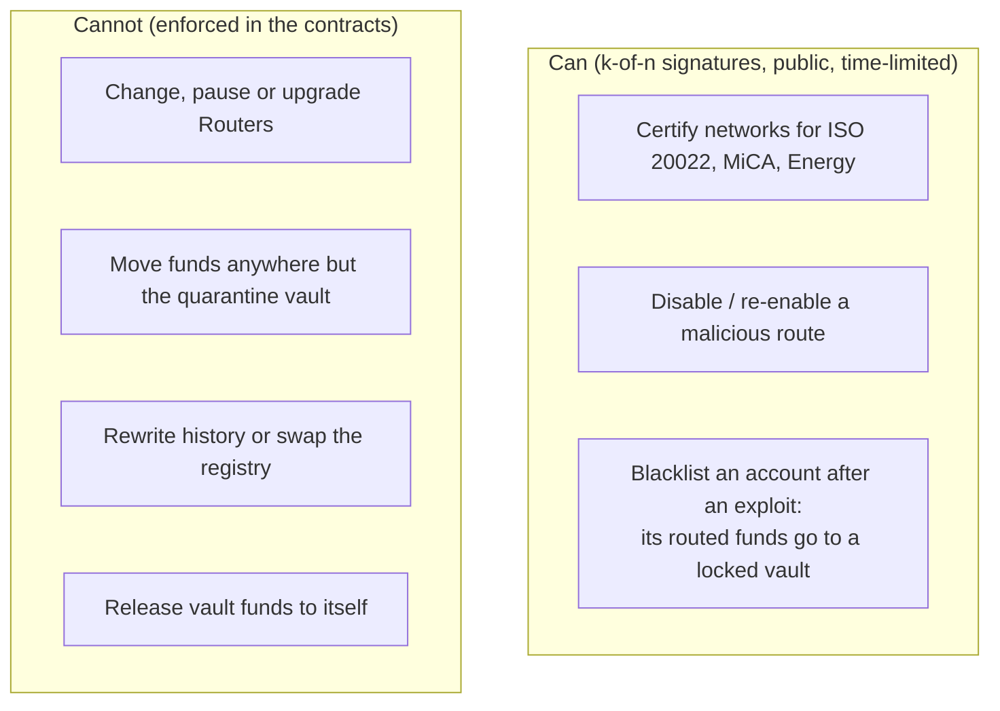

<p align="center">
  <a href="https://coldai.org">
    <picture>
      <source media="(prefers-color-scheme: dark)" srcset=".github/assets/coldai-logo-white.png">
      
    </picture>
  </a>
</p>

<h1 align="center">CLPRouter</h1>

<p align="center">
  <strong>Multi-hop routing for CLPR.</strong><br>
  Send a message or a payment between any two ledgers, even when they share no direct channel.<br>
  Cheapest, fastest, most reliable or greenest route, with ISO&nbsp;20022, MiCA and Energy filters.
</p>

<p align="center">
  <a href="LICENSE"></a>
  
  
  
  
</p>

---

## What it is

[CLPR](https://github.com/LFDT-CLPR) is a bridgeless cross-ledger protocol from LF Decentralized Trust: two ledgers
verify each other's state proofs directly, with no bridge validators and no pooled liquidity. CLPR is
**point-to-point**: a Channel joins exactly two ledgers.

**CLPRouter turns those channels into a network.** It is an application on top of CLPR, with no protocol change,
that forwards a routed message hop by hop until it reaches its destination, sends a receipt back to the origin and
settles or refunds the sender's escrow. A route is only ever as trusted as its weakest hop, and every hop re-checks
the sender's rules on-chain.



## Why

| Without a router | With CLPRouter |
|---|---|
| Every pair of ledgers needs its own Channel and verifiers both ways: 100 ledgers means 4,950 pairs | One Channel per ledger to a hub is enough: 100 ledgers, 100 Channels |
| Each application reinvents forwarding, fees, receipts and refunds | Forwarding, fee budgets, end-to-end receipts, deadlines and refunds are built in |
| No way to ask for "the cheapest compliant route" | Five routing modes and three compliance filters, combinable |

## Highlights

- **Five routing modes:** cheapest, fastest (p90), most reliable (with a disjoint fallback route), greenest (kgCO2e
  per message) and balanced.
- **Three filters, combinable with any mode:** ISO&nbsp;20022, MiCA and Energy. Every ledger on the route must pass,
  origin and destination included: `fastest + ISO 20022`, `greenest + MiCA + Energy`.
- **ISO&nbsp;20022 native:** pacs.008, pacs.009, pacs.002, camt.056, pacs.004 and camt.029; the UETR travels end to end;
  the payment message is encrypted to the destination institution, and only hashes go on-chain.
- **Decentralised by default:** immutable Router contracts with no admin key and no pause; route planning runs on the
  sender's side; anyone can run a Connector, relayer, indexer or regulated hop and earn fees.
- **A provider with a narrow role:** a k-of-n committee can certify networks, disable a malicious route and, after an
  exploit, divert a blacklisted account's routed funds to a locked quarantine vault. It cannot change code, redirect
  routes or take funds, and every action is public, signed and time-limited.
- **Real data:** the route graph covers 86 chains with gas and calldata measured on live data by the
  [CLPR verifier work](https://github.com/LFDT-CLPR/clpr-smart-contracts/pulls).

## How a route travels



## How a route is chosen



| Mode | Optimises |
|---|---|
| Cheapest | Total fees in one quote currency |
| Fastest | Expected (p90) time to delivery |
| Most reliable | Chance of on-time delivery at a trust floor, with a disjoint fallback route |
| Greenest | Estimated kgCO2e per message, from certified emissions figures |
| Balanced (default) | Weighted cost, time, reliability and carbon |

## The provider: what it can and cannot do



## Repository

| Path | What |
|---|---|
| [`src/`](src) | Solidity: `ClprRouter`, `ProviderRegistry`, `QuarantineVault`, the envelope codec |
| [`src/settle/`](src/settle) | Settle on Hedera: bonded Connectors, an order book on Hedera, Deposit and Delivery contracts ([doc](docs/settle-on-hedera.md)) |
| [`proto/`](proto) | `ClprRouteEnvelope` protobuf schema |
| [`sdk/`](sdk) | TypeScript planner, envelope builder, ISO&nbsp;20022 module, measured route-graph data |
| [`services/`](services) | Indexer, route status API, quote service, public forward trigger; reference settle Connector (`services/connector`) |
| [`registry-data/`](registry-data) | ISO&nbsp;20022, MiCA and Energy evidence and draft provider decisions |
| [`docs/`](docs) | Technical reference, threat model, integrator, operator and committee guides, audit pack |
| [`test/`](test) | Unit, fuzz, invariant, security and end-to-end tests (three EVM ledgers, and through Hiero) |

## Quick start

```sh
git clone --recurse-submodules https://github.com/ColdAI-org/clprouter && cd clprouter

forge test --skip 'script/**'          # contracts: unit, fuzz, invariant, security
(cd sdk && pnpm install && pnpm test)  # planner, envelope, ISO 20022
(cd services && pnpm install && pnpm test)

script/e2e/run.sh                      # A -> B -> C and back across three local anvil chains
```

The full design, contract internals, gas figures and the end-to-end run through a local Hiero network are in the
[technical reference](docs/technical-reference.md).

## Status

CLPRouter is **pre-release**. Do not use it with real funds.

| | |
|---|---|
| Contracts, SDK, services | Built and tested locally; testnet deployment in progress |
| Security | Two internal audits; all findings fixed with regression tests; independent re-audit in progress. No external audit yet. |
| Forwarding | On the reference CLPR Service each hop completes in a second transaction (`forward()`), because one reentrancy lock covers sending and receiving |
| Hiero to other ledgers | Waits on a Hiero state-proof source; until then the Hiero → chain legs run on a test verifier in local tests only |
| Provider | A real provider committee, its key ceremony and legal review of the quarantine vault are prerequisites for mainnet |

Design spec: [ADR "Multi-hop routing over CLPR"](docs/technical-reference.md). Threat model:
[docs/threat-model.md](docs/threat-model.md).

## Contributing and security

Contributions are welcome: see [CONTRIBUTING.md](CONTRIBUTING.md) (DCO sign-off required). Please report
vulnerabilities privately as described in [SECURITY.md](SECURITY.md), not in public issues.

## License

[MIT](LICENSE) © 2026 ColdAI. CLPR itself, included as a submodule, is licensed separately under Apache-2.0 by
LF Decentralized Trust.

<p align="center">
  <br>
  <a href="https://coldai.org">
    <picture>
      <source media="(prefers-color-scheme: dark)" srcset=".github/assets/coldai-logo-white.png">
      
    </picture>
  </a>
  <br>
  <sub>Built by <a href="https://coldai.org">ColdAI</a></sub>
</p>
