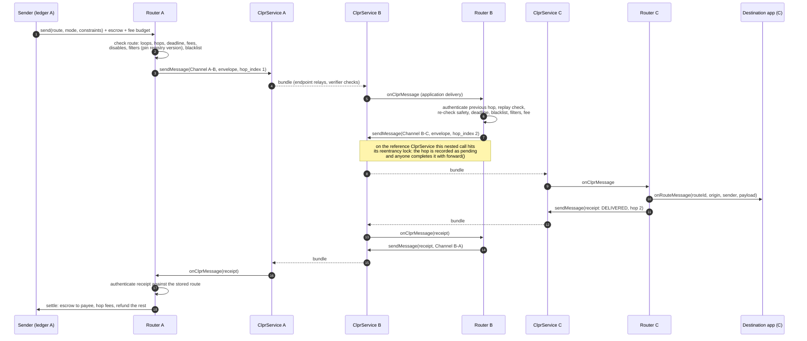
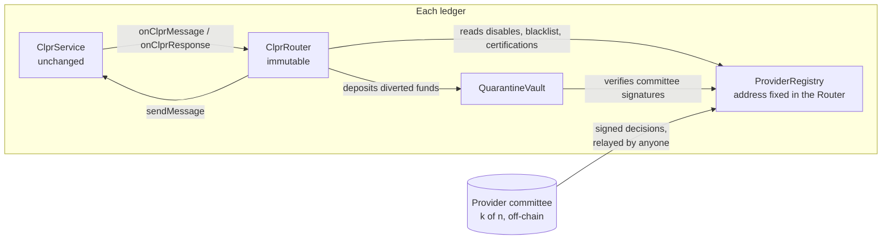

# CLPRouter

CLPRouter delivers a message, and optionally an escrowed payment, between two ledgers that share no
[CLPR](https://github.com/LFDT-CLPR) Channel by forwarding it across intermediate ledgers. It is a CLPR
**application**: it uses `sendMessage` and application delivery, and the CLPR Service on each ledger stays
unchanged.

This repository holds the on-chain core (phase 1 of the plan): the Router, the provider registry, the
quarantine vault, the route envelope (Solidity codec and protobuf schema), and the tests. The planner SDK
lives in `sdk/`.

## Contents

| Path | What it is |
| --- | --- |
| `src/ClprRouter.sol` | One Router per ledger. Immutable, no admin key, no pause. |
| `src/ProviderRegistry.sol` | Append-only registry of committee decisions: certifications, disables, blacklist. |
| `src/QuarantineVault.sol` | One vault per ledger for funds diverted by the blacklist. Fixed release rules. |
| `src/libraries/RouteCodec.sol` | Protobuf encoder and decoder for the envelope and receipts (external library). |
| `src/libraries/RouteLogic.sol` | Route structure, route-safety, filter and receipt-path checks (external library). |
| `src/libraries/Caip.sol` | CAIP-10 ids and the ledger-independent registry keys. |
| `proto/clprouter/v1/route_envelope.proto` | `ClprRouteEnvelope` and `ClprRouteReceipt`. |
| `test/unit/` | Foundry tests (146). |
| `script/E2E.s.sol`, `script/e2e/run.sh` | End-to-end run on three anvil chains. |
| `lib/clpr-smart-contracts` | The CLPR reference contracts (submodule, branch `pr/eth-live-proofs`), unchanged. |

## Architecture



Every ledger runs the same set of contracts:



### Router

- **`send`** takes the planner's route (`hops[0]` is this ledger and this Router), the mode, the constraints,
  a fee budget (`msg.value - escrow`) and an optional escrow with a payee. Before any value moves it checks the
  structure (at least one edge, at most `max_hops` edges, no ledger twice), the deadline, the fee totals against
  the budget and `max_fee`, route safety on every edge, ledger and Router, and every active filter on every
  ledger. It stamps the sender's CAIP-10 id, pins the registry version for each filter, and sends the envelope.
- **Intermediate hops** run inside CLPR application delivery. The Router checks that the envelope is addressed to
  it, that it came over the named Channel from the Router named for the previous hop, and that the Channel's peer
  is the ledger the envelope claims; it rejects replays (every route id it has seen) and route-version mismatches.
  It then re-checks route safety, the deadline, the blacklist, the filters at the pinned version and the fee
  budget, takes its hop's fee from the budget and calls `sendMessage` on the next Channel. Its CLPR Response to
  the previous hop says only accepted or rejected with a reason.
- **The destination** delivers to the application (`IClprRouteApplication.onRouteMessage`) and sends a receipt.
- **Receipts** are new routed messages back to the origin: `DELIVERED`, `FAILED`, `EXPIRED` or `QUARANTINED`, with
  the reporting hop, a reason, and for quarantine the case id and the provider's contact. A hop that stops a route
  sends the receipt itself. Receipts travel the reverse of the route (or an explicit `receipt_path` for delivery
  receipts of data routes).
- **The origin** authenticates a receipt against what it stored at send time: it must arrive from the first-hop
  Router over the first Channel, carry the route's hops unchanged (strict routes), and have travelled the exact
  reverse path from the reporting hop (strict routes without an explicit receipt path). It then pays the fees of
  the hops that forwarded, releases the escrow to the payee on `DELIVERED`, refunds it on `FAILED` or `EXPIRED`,
  or moves everything into the vault on `QUARANTINED`. If no receipt comes, anyone can `reclaim` after the deadline
  plus a grace period, which refunds the sender.
- **Strict and loose routing.** Strict routes cannot change. Under loose routing, a hop whose forward was rejected
  at the CLPR level (or whose `sendMessage` failed) can be re-routed over a new tail by anyone calling
  `forward(envelope, newTail)`; the tail is checked like a new route. Routes that carry value must be strict.

### Forwarding inside delivery, and the pump

The spec asks each Router to call `sendMessage` on the next Channel in the same transaction as delivery. The
reference Solidity `ClprService` guards both `submitBundle` and `sendMessage` with one transient reentrancy lock,
so that nested call reverts with `ReentrancyGuardReentrantCall()`. The Router recognises exactly that error and
records the hop as pending (`ForwardPending` for forwards, `OutboxQueued` for receipts). Anyone, for example the
endpoint that submitted the bundle, completes it in the next transaction with `forward(envelope, [])` or `flush`.
All checks run again at that point, and the envelope must hash to the recorded value. On a CLPR Service that
allows sends during delivery (as a platform with system-level dispatch might), the hop goes out directly in the
same transaction; `test/unit/RouterHop.t.sol` covers that path with a mock Service.

### Provider registry

The provider committee (k of n) can do three things, and only through this registry:

| Action | Signatures | Takes effect | Lapses |
| --- | --- | --- | --- |
| Certify (ISO 20022, MiCA, Energy) with evidence hash, expiry (at most a year) and, for Energy, the emissions figure in µgCO2e per transaction and its source | k | after 7 days' notice | at expiry |
| Uncertify | k | after 72 hours' notice | — |
| Disable a Channel direction, a ledger, a Router deployment or a Router version | k + 1 | immediately | after 7 days unless renewed |
| Re-enable | k | after 7 days' notice | — |
| Blacklist a CAIP-10 account under a case id | k + 1 | immediately | after 30 days unless renewed |
| Delist | k | immediately | — |
| Change the committee or the contact address | k (current committee) | immediately, new epoch | — |

Notice and lapse periods are constructor parameters; the values above are the spec's recommendations and the
ones the tests use. A decision is signed once over a ledger-independent digest and can be relayed by anyone to
the registry on any ledger. Every applied decision increments the registry **version** and must carry nonce
`version + 1`, so every ledger's registry passes through the same versions. A route pins the version it was sent
against in `filter_registry_versions`; each hop reads certifications as of that version (later entries are
ignored, and a registry that has not reached the version fails closed). Notice periods and expiry are checked
separately against the hop's clock. Routes without filters never read certifications. Every action emits an event
with its evidence hash and decision digest.

### Quarantine vault

When a sender, recipient or payee is blacklisted, the Router holding the funds stops the route. At the origin, all
of `msg.value` goes into the origin ledger's vault before anything is sent. Further along the route, the stopping
Router emits a notice to the recipient (and calls the recipient app's `onRouteNotice` hook at the destination) and
sends a `QUARANTINED` receipt; the origin then puts the escrow and the unused fee budget into its vault under the
route id and case id. In phase 1 only the origin holds funds, so that is where the vault deposit happens.

Releases need a committee decision and go only to the original sender, the original recipient (the payee), or a
recovery address the committee named for the case. A recovery release waits for a notice period and a challenge
window, during which the sender or recipient can object, which blocks that address. Nothing can go to any past or
present committee member, the registry or the vault, and nothing moves without a case id.

## Trust model

- **No new trust in the data path.** Each hop is verified by its Channel's verifier, exactly as in CLPR. A route is
  as strong as its weakest hop, and that includes the Router on each hop: the origin and sender fields the
  destination sees are only as good as every Router and verifier along the route.
- **No operator.** Routers have no admin key and cannot be paused or upgraded. New versions are deployed beside old
  ones, and each envelope names the version every hop must run. Forwarding needs no one's permission: inside
  delivery, or through the permissionless `forward` and `flush`.
- **The provider's role is limited, and the contracts enforce the limits.** The committee can only certify and
  uncertify networks for filters, switch routes off and on, and blacklist accounts. It cannot change Router code,
  fees, Connectors, Channels or verifiers. It cannot redirect funds: the only place it can send them is the
  quarantine vault, and the vault only pays the original parties or a recovery address after a public notice and
  challenge window, never a committee account. Certification changes cannot reach routes already under way,
  because routes pin the registry version. Disables and blacklist entries are temporary unless renewed. Every
  decision needs k (certifications) or k + 1 (disables, blacklist) committee signatures and is public.
- **Worst case.** If committee keys were compromised, filtered routes could carry false labels, and routes could be
  stopped or funds parked in the vault until the committee is replaced. Funds could not be taken, and CLPR
  verification would be unaffected.
- **Fake Routers.** Anyone can deploy a Router, and the planner may use it. A hop authenticates the previous hop
  as the Router named in the envelope, so a malicious Router can only affect routes that the sender chose to send
  through it. For value routes, the origin also checks that receipts came back along the exact route it sent.
  The provider can disable a malicious Router deployment or version.

## Running the tests

Requires Foundry (tested with forge 1.5.1).

```sh
git submodule update --init --recursive
forge build --sizes --skip 'test/**' --skip 'script/**'   # contract sizes (all under 24,576 B)
forge test                                                # 146 unit and in-process integration tests
script/e2e/run.sh                                         # three anvil chains, five routes (~9 minutes)
```

`forge test` covers the codec (including fuzzing), the registry (signatures, thresholds, replay, ordering, epochs,
notice periods, lapse, version pinning), the vault (release rules, recovery window, challenges, provider accounts),
the Router at a single hop against a mock Service, and full A → B → C routes on three reference `ClprService`
instances in one EVM, with every failure path: disabled edge, ledger or Router, a message over a disabled inbound
edge, blacklist at the origin, mid-route and at the destination, late blacklist before settlement, deadline,
application revert, loops, max hops, replay, forged receipts, filters and fee limits.

`script/e2e/run.sh` starts three anvil chains (ports 18545 to 18547; override with `PORT_A`, `PORT_B`, `PORT_C`),
deploys everything with the CLPR repo's `E2EVerifier`, and sends five routes from A to C: delivered, destination
app reverts, edge B → C disabled mid-route, recipient blacklisted on B, and deadline passed. Each step is a separate
`forge script` run. The gas of every transaction is written to `e2e-out/gas.tsv`.

## Gas (anvil, reference ClprService, three-hop route with escrow)

| Step | Gas |
| --- | --- |
| `send` on A | 1.79M |
| Hop B: `submitBundle` with delivery, then `forward` | 1.29M + 1.54M |
| Destination C: `submitBundle` with delivery to the app, then `flush` of the receipt | 1.50M + 1.46M |
| Receipt at B: `submitBundle`, then `forward` | 1.15M + 1.65M |
| Settlement on A: `submitBundle` | 1.35M |

Every transaction fits well inside Hedera's 15M gas limit. The main costs are CLPR storing each outbound payload
in its queue (about 20k gas per 32-byte word) and the Solidity protobuf codec; they have not been profiled yet.

## Open issues

- **Forwarding inside delivery** needs a CLPR Service that permits `sendMessage` during application delivery. On
  the reference Solidity Service each hop takes a second, permissionless transaction.
- **Trust floor** is carried in the envelope but enforced only by the planner: no on-chain source of verifier
  trust tiers exists yet.
- **Loose routes** do not have their receipts checked against a stored hop list, because the tail may change. Their
  fee payouts trust the Routers on the route. Value routes are strict.
- **Per-hop escrow and asset routing** are phase 4. In phase 1, only the origin holds funds, so a blacklist hit
  further along the route quarantines the escrow on the origin ledger.
- **Gas.** Receipts carry the route's hop list so the origin can verify them. A compact commitment instead would
  make receipts smaller and cheaper.
