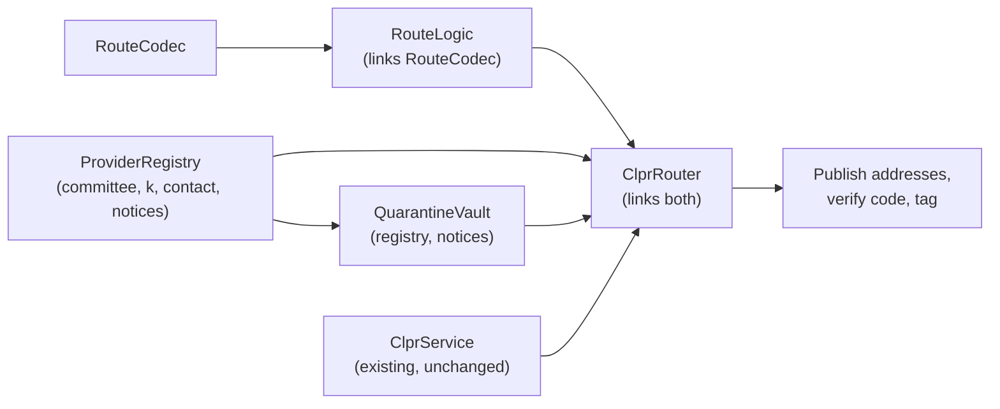
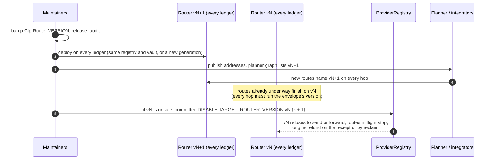

# Deployment guide

How to deploy a CLPRouter generation on a ledger, which networks it runs on today, and how upgrades work when every
contract is immutable.

## 1. What a ledger needs

| Contract | Constructor | Notes |
| --- | --- | --- |
| `RouteCodec` (external library) | — | Linked into `ClprRouter` and `RouteLogic` |
| `RouteLogic` (external library) | — | Linked into `ClprRouter` |
| `ProviderRegistry` | `(address[] members, uint8 k, string contact, uint64[5] notices)` | `members` sorted ascending; `notices = [CERT_NOTICE, REMOVAL_NOTICE, REENABLE_NOTICE, DISABLE_LAPSE, BLACKLIST_LAPSE]` |
| `QuarantineVault` | `(IProviderRegistry registry, uint64 recoveryNotice, uint64 challengeWindow)` | One per ledger |
| `ClprRouterDeployer` | `(address owner, bytes32 deploymentSalt, bytes32 routerInitCodeHash, Pins pins)` | Same address on every ledger (deterministic-deployment proxy, same arguments). `pins` = `(reclaimGrace, appGas, minSendGas, registryCodeHash, registryGenesis, vaultCodeHash)`, range-checked; every Router it deploys uses these parameters and only a registry and vault with this code (and this initial committee) |
| `ClprRouter` | none: `ClprRouterDeployer.deploy(initCode, (service, registry, vault, ledgerId, reclaimGrace, appGas, minSendGas))` | Lands at the ledger's canonical CREATE2 address. Reverts `LedgerMismatch` unless `ledgerId` equals the Service's configured chain id, and `InvalidParameters` unless the parameters, registry and vault match the deployer's pins |

The CLPR Service, its verifiers and Connectors are deployed by CLPR, not here. CLPRouter needs the Service's address
and live Channels to the neighbouring ledgers, each with a real verifier.



## 2. Parameters per ledger

| Parameter | Tests and e2e | How to choose it |
| --- | --- | --- |
| `ledgerId` | `eip155:31001` … | Exactly the Service's configured chain id string (`getLedgerConfiguration().chainId`). The CLPR testnet Services use the bare number (`296`, `11155111`), so routes, CAIP-10 sender and recipient ids and registry keys on those ledgers use that form; the SDK's CAIP-2 checks (`isCaip2`, `assertNoClearPersonalData`) expect `eip155:<n>` |
| `members`, `k` | 5 members, k = 3 | From the key ceremony (`docs/provider-committee-runbook.md`); identical on every ledger |
| `contact` | test string | Provider contact quoted in quarantine notices (URL, e-mail or CAIP-10) |
| `notices` | 7 days, 72 hours, 7 days, 7 days, 30 days | Identical on every ledger |
| `recoveryNotice`, `challengeWindow` | 3 days, 7 days | Identical on every ledger |
| `reclaimGrace` | 1 hour (6 hours on the testnets) | Above the worst-case time for one receipt edge, including proof generation and pumping (threat model R4); 1 hour .. 30 days. One value for the whole deployment (deployer pin) |
| `appGas` | 300,000 | Gas for destination apps and callbacks; publish it, integrators design to it; 50,000 .. 10,000,000 |
| `minSendGas` | 1,500,000 | The measured gas of `ClprService.sendMessage` on this ledger with its Connector, plus margin. On the reference Service with the mock Connector it is about 1.2M |

Every number here is immutable once deployed. The Router's three gas and grace parameters are fixed for the whole
deployment by the deployer's constructor, and the registry and vault must be built with the same arguments on every
ledger (their code hashes and the registry's genesis head are pinned too).

## 3. Deploy

`script/deploy/deploy.sh <network> [--broadcast]` is the supported path. It reads `script/deploy/config/<network>.json`
and the committee file in `deployments/`, creates every contract through the CREATE2 deployment proxy (addresses
depend only on bytecode, constructor arguments and the configured salt), re-uses a contract whose address already
has code, runs the post-deploy checks below as `require`s, and records the result in `deployments/<network>.json`.
Without `--broadcast` it simulates against a fork and prints the addresses; against an existing deployment that run
is the verification. The script reads the deployer key from an env file outside the repository and never prints it.

What it does, by hand (order and arguments as in `script/E2E.s.sol:deployStack`):

```sh
# 1. Build exactly the released sources (or use the release tarball's artifacts/ and build-info/).
git checkout vX.Y.Z && git submodule update --init --recursive
forge build --sizes --skip 'test/**' --skip 'script/**'     # ClprRouter must be under 24,576 B

# 2. External libraries first; the Router and RouteLogic link them.
LIBS=(--libraries "src/libraries/RouteCodec.sol:RouteCodec:$CODEC" --libraries "src/libraries/RouteLogic.sol:RouteLogic:$LOGIC")
forge create src/libraries/RouteCodec.sol:RouteCodec "${LIBS[@]}" --rpc-url "$RPC" --account deployer --broadcast
forge create src/libraries/RouteLogic.sol:RouteLogic "${LIBS[@]}" --rpc-url "$RPC" --account deployer --broadcast

# 3. Registry, vault, Router (constructor arguments from section 2; durations in seconds).
forge create src/ProviderRegistry.sol:ProviderRegistry --constructor-args "[$MEMBERS]" 3 "$CONTACT" "[604800,259200,604800,604800,2592000]" ...
forge create src/QuarantineVault.sol:QuarantineVault --constructor-args "$REGISTRY" 259200 604800 ...
forge create src/ClprRouter.sol:ClprRouter "${LIBS[@]}" --constructor-args "$SERVICE" "$REGISTRY" "$VAULT" "$LEDGER_ID" 3600 300000 1500000 ...
```

`$CODEC` and `$LOGIC` are the libraries' predicted addresses (CREATE2, or `cast compute-address` from the deployer's
nonces as in `script/e2e/run.sh`). Use a hardware wallet or KMS-backed account for anything beyond a testnet; never a
private key on the command line. None of these contracts has an owner, except `ClprRouterDeployer.OWNER`, which can
only deploy the canonical Router of a ledger that has none yet, with the pinned parameters, registry code and vault
code; it still chooses that ledger's CLPR Service, so keep the owner key offline (or make it a multisig in the
constructor) and retire it once every planned ledger is deployed.

**Checks after deploying, on every ledger:**

1. `ClprRouter.ledgerId()`, `SERVICE()`, `REGISTRY()`, `VAULT()`, `RECLAIM_GRACE()`, `APP_GAS()`, `MIN_SEND_GAS()`,
   `VERSION()` return the intended values.
2. `ProviderRegistry.members()`, `threshold()`, `epoch() == 0`, `version() == 0`, `contact()`, and the five notice
   values. `QuarantineVault.REGISTRY()`, `RECOVERY_NOTICE()`, `CHALLENGE_WINDOW()`.
3. Runtime code matches the release build (immutables masked), and the source is verified on the ledger's explorer
   from the release's `build-info/`.
4. Relay every registry decision already applied on the other ledgers, in nonce order, until `version()` matches
   (section 5).
5. **Approve the Channels.** Routers carry nothing over a Channel direction the registry does not label. For each
   Channel the ledger will use, the committee signs `TRUST_TIER(channelId, toLedgerId, tier, verifier, codeHash)` for
   both directions, where `verifier` is `getChannel(channelId).verifier` on the receiving ledger and `codeHash` its
   `EXTCODEHASH`, and relays it to every ledger; it takes effect after `CERT_NOTICE`
   (`docs/provider-committee-runbook.md` section 6). Testnets: `script/deploy/route.sh approve-sepolia` and
   `approve-hedera`.
6. **Hiero ledgers, sending side.** Before approving a Hiero → chain direction, send one message from the Hiero
   Router and check on the receiving side that the CLPR sender stamped for it equals its canonical address
   (`ClprRouterDeployer.routerAddress(ledgerId)`): a different stamped sender would make every message from it fail
   previous-hop authentication.
7. A data route from and to this ledger over a test Channel, on its testnet.

## 4. Networks

### 4.1 Local

| Ledger | CAIP-2 | How | Verifier |
| --- | --- | --- | --- |
| anvil A, B, C | `eip155:31001`, `eip155:31002`, `eip155:31003` | `script/e2e/run.sh` (ports 18545 to 18547) | CLPR `E2EVerifier` (no proof checks) |
| Hiero Solo H | `eip155:1338` | `script/e2e-hiero/run.sh` with a Solo network from the CLPR repo | CLPR `E2EVerifier` |

Hedera EVM specifics seen on Solo: values are in tinybars inside the EVM; transactions are legacy with the gas price
floored at `eth_gasPrice`; the e2e uses forge's gas estimate × 1.3. The largest deployment on Hiero is the Router at
5,127,331 gas consumed (34% of Hedera's 15M transaction limit).

### 4.2 Testnets and mainnets

Addresses are not copied into this document. `script/deploy/deploy.sh` writes them, with the transaction hashes and
the post-deploy check results, to `deployments/<network>.json`; that file is the source of truth, and the GitHub
release notes for a tag list the addresses it was deployed at.

| Network | CAIP-2 | Deploy config | Addresses |
| --- | --- | --- | --- |
| Ethereum Sepolia | `eip155:11155111` | `script/deploy/config/sepolia.json` | `deployments/sepolia.json` |
| Hedera testnet | `eip155:296` | `script/deploy/config/hedera-testnet.json` | `deployments/hedera-testnet.json` |
| Hedera mainnet | `eip155:295` | none | not deployed (see below) |

The testnet committee (`deployments/test-committee.json`) uses throwaway keys and is not a production committee.

Release `0.1.0` is for local networks and testnets only. Before any mainnet deployment:

- Every Channel a route may use must run a real verifier. **Never wire `E2EVerifier` or any other non-verifying
  verifier on a live network**: it would let anyone forge envelopes and `DELIVERED` receipts (threat model R6).
- Routes cannot leave Hiero until a Hiero state-proof source exists (a block node serving HIP-1081
  `getStateProof` for EVM storage slots) and the CLPR `HieroVerifier` is deployed on the far side.
- The legal review gate G1 must be passed before the first blacklist decision
  (`docs/provider-committee-runbook.md`, section 9).
- An external audit of the release (`docs/audit-readiness.md`).

## 5. Upgrades: deploy a new version

Contracts are immutable: no proxy, no admin key, no pause. An upgrade is a new deployment beside the old one.



1. **Bump `VERSION`.** Every hop rejects an envelope whose `router_version` differs from its own (`WrongVersion`), so
   a route runs on one version end to end. A new version that keeps the old `VERSION` would mix code on one route.
2. **Reuse or replace the registry and vault.** A Router's registry and vault are fixed at its deployment.
   - Reuse when the decision rules and parameters do not change: deploy only new Routers pointing at the existing
     registry and vault on each ledger. Committee decisions keep applying to both versions.
   - Replace when the registry or vault code or any notice parameter changes: deploy a new registry (starting at
     `version() == 0` and epoch 0 with the constructor committee) and vault. Live certifications, labels, disables and
     listings do not carry over; the committee re-signs the ones still needed, in nonce order, for the new registry.
3. **Retire the old version.** Leave it running while routes drain (at least the longest deadline plus
   `RECLAIM_GRACE`). Only if it is unsafe, the committee disables it with `DISABLE(TARGET_ROUTER_VERSION, vN)`. Routes
   in flight then stop at their next hop with a `FAILED` receipt, but receipts that reach a vN Router are dropped
   too, so those origins refund through `reclaim` after the deadline plus `RECLAIM_GRACE`. A disable lapses after `DISABLE_LAPSE` unless renewed, so for a permanent
   retirement rely on the planner and integrators no longer naming vN.
4. **Funds.** The old Router keeps escrow of its pending routes until they settle or are reclaimed; `reclaim` stays
   open forever. Old vault deposits stay in the old vault and are released under its rules.
5. **Recognising deployments.** The ADR recommends one address per version per platform (deterministic deployment)
   where the platform allows it. Because constructor arguments include the ledger id, Router addresses differ per
   ledger; recognise a deployment by comparing its runtime code with the release build (immutables masked) and by the
   addresses published for the tag.

## 6. Size budget

`ClprRouter` is 24,477 B of runtime code, 99 B under EIP-170 (24,576 B), compiled with `optimizer_runs = 200`
(`compilation_restrictions` in `foundry.toml`); everything else uses 2,000 runs. CI fails on any contract over the
limit. Measured sizes at release `0.1.0`:

| Contract | Runtime (B) | Initcode (B) |
| --- | --- | --- |
| `ClprRouter` | 24,477 | 26,202 |
| `RouteLogic` | 13,062 | 13,095 |
| `ProviderRegistry` | 12,300 | 13,808 |
| `RouteCodec` | 9,837 | 9,867 |
| `QuarantineVault` | 5,593 | 5,836 |
