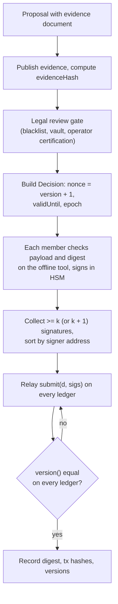

# Provider committee runbook

How the provider committee holds and uses its keys. The committee is the only privileged role in CLPRouter. It acts
only through `ProviderRegistry` (certifications, trust-tier labels, disables, blacklist, its own membership, the
contact address) and `QuarantineVault` (naming a recovery address, releasing a deposit). It cannot change Router
code, fees, Channels, Connectors or verifiers, and the vault refuses to pay any past or present member.

Every procedure below ends with a public, signed, on-chain record. Keep the evidence documents public too: the
registry stores only their hash.

## 1. Parameters

| Parameter | Where | Recommended | Notes |
| --- | --- | --- | --- |
| n (members) | `COMMITTEE` decision / constructor | ≥ 5, different jurisdictions and organisations | `k + 1 ≤ n` is enforced |
| k (threshold) | same | ≥ 3 | Certify, uncertify, trust tier, enable, delist, committee, contact, vault actions |
| k + 1 | derived | — | `DISABLE` and `BLACKLIST` |
| `CERT_NOTICE` | registry constructor | 7 days | Certify; raise a trust tier |
| `REMOVAL_NOTICE` | registry constructor | 72 hours | Uncertify; lower or remove a trust tier |
| `REENABLE_NOTICE` | registry constructor | 7 days | Re-enable after a disable |
| `DISABLE_LAPSE` | registry constructor | 7 days | A disable ends unless renewed |
| `BLACKLIST_LAPSE` | registry constructor | 30 days | A listing ends unless renewed |
| `MAX_CERT_DURATION` | constant | 366 days | Certification expiry cap |
| `RECOVERY_NOTICE` | vault constructor | 3 days | Before a recovery release |
| `CHALLENGE_WINDOW` | vault constructor | 7 days | Sender or recipient may challenge a recovery address |

Notice and lapse values are immutable per deployment. Changing them means deploying a new registry, vault and Router
generation (`docs/deployment.md`).

## 2. Signing format

A decision is `Decision{action, payload, evidenceHash, nonce, effectiveAt, validUntil, epoch}`
(`IProviderRegistry.Decision`). Members sign:

```
digest = keccak256(abi.encode(DOMAIN, action, keccak256(payload), evidenceHash, nonce, effectiveAt, validUntil, epoch))
DOMAIN = keccak256("CLPRouter.ProviderRegistry.v1")
signed = keccak256("\x19Ethereum Signed Message:\n32" ‖ digest)           // EIP-191
```

- Signatures are 65-byte secp256k1 `r ‖ s ‖ v` with low `s` (OpenZeppelin `ECDSA.tryRecover` rejects high `s`).
  Normalise HSM output before submitting.
- The `sigs` array must be ordered by **ascending signer address**, with no duplicates, all members of the current
  epoch. Extra valid signatures beyond the threshold are accepted.
- The digest has no ledger id: one signed decision applies on every ledger. Compute it with
  `ProviderRegistry.decisionDigest(d)` on any ledger and compare with the offline tool's result before signing.
- `nonce` must equal `version() + 1` on the ledger it is relayed to. Registry decisions form one global sequence.
  Vault decisions (`VAULT_RELEASE` = 9, `VAULT_NAME_RECOVERY` = 10) are not part of that sequence; use a unique nonce
  per vault decision.

| Action | Number | Payload (`abi.encode`) | Signatures |
| --- | --- | --- | --- |
| `CERTIFY` | 1 | `(string ledgerId, uint8 label, uint64 expiry, uint64 emissionsUg, string emissionsSource)` | k |
| `UNCERTIFY` | 2 | `(string ledgerId, uint8 label)` | k |
| `DISABLE` (also renews) | 3 | `(uint8 kind, bytes32 subject, string reason)` | k + 1 |
| `ENABLE` | 4 | `(uint8 kind, bytes32 subject)` | k |
| `BLACKLIST` (also renews) | 5 | `(string caip10, bytes32 caseId, string reason)` | k + 1 |
| `DELIST` | 6 | `(string caip10, bytes32 caseId)` | k |
| `COMMITTEE` | 7 | `(address[] members, uint8 threshold)`, members sorted ascending | k |
| `CONTACT` | 8 | `(string contact)` | k |
| `TRUST_TIER` | 11 | `(bytes32 channelId, string toLedgerId, uint8 tier)`; `tier = 255` removes the label | k |
| `VAULT_NAME_RECOVERY` | 10 | `(bytes32 caseId, address to)` | k |
| `VAULT_RELEASE` | 9 | `(uint256 depositId, bytes32 caseId, uint8 kind)`; kind 0 sender, 1 recipient, 2 recovery | k |

Labels: 1 ISO 20022, 2 MiCA, 3 Energy. Disable kinds: 1 Channel direction (subject `edgeKey(channelId, toLedgerId)`),
2 ledger (`ledgerKey(ledgerId)`), 3 Router deployment (`routerKey(ledgerId, router)`), 4 Router version
(`routerVersionKey(version)`). Every key function is a public view on the registry, so a key can be computed with
`cast call <registry> "edgeKey(bytes32,string)(bytes32)" <channelId> <ledgerId>`.

## 3. Key ceremony (HSM)

Goal: n independent secp256k1 keys, each generated and held in a member's HSM, never exported, with an auditable
record of who holds which address.

**Before the ceremony**

1. Each member obtains an HSM that supports secp256k1 ECDSA with non-exportable keys (FIPS 140-3 level 3 or
   equivalent), plus a second unit or an HSM-native backup mechanism (wrapped backup to a second HSM under a key
   split between at least two of the member's officers).
2. Agree the ceremony script, the witnesses (at least two, one independent of the provider), and the recording
   method. Prepare an air-gapped host with the offline signing tool built from a tagged release, with its checksum
   recorded.

**During the ceremony (per member, may be remote and witnessed by video)**

1. Initialise the HSM, set officer and operator credentials under split knowledge (no single person holds both).
2. Generate the secp256k1 key inside the HSM, marked non-exportable.
3. Export the public key, derive the Ethereum address, and sign a fixed attestation message
   (`CLPRouter committee <epoch> member <name> <date>`) with the new key. The witnesses verify the signature.
4. Create the backup unit or wrapped backup, verify it signs the same attestation, and seal it at a second site.
5. Record: member, organisation, jurisdiction, HSM model and serial, address, attestation signature, witnesses. Each
   witness signs the record.

**After the ceremony**

1. Publish the member list (addresses and organisations) and the ceremony records with the evidence hash.
2. Sort the addresses ascending. For the first deployment they go into the `ProviderRegistry` constructor with k
   (`docs/deployment.md`). For a later change they go into a `COMMITTEE` decision (section 5).
3. Every member signs a test decision on a testnet registry and the signatures are checked with
   `checkApproval(digest, epoch, sigs, required)` before mainnet use.

Never: generate keys on a networked host, put a key on a laptop or a cloud VM disk, share one HSM between members,
or let one person hold a quorum of HSM credentials.

## 4. Making a decision (k of n)



1. **Proposal.** Any member drafts the decision and the evidence document (for certifications, the evidence record
   from `registry-data/evidence/`; for disables, the incident report; for blacklist, the case file).
2. **Independent check.** Each signing member recomputes the payload and the digest themselves from the proposal,
   on the air-gapped host, and compares with the proposer's. A member signs only what they recomputed.
3. **Set `validUntil`** long enough to relay on every ledger (at least 24 hours, more if a ledger is congested) and
   `effectiveAt` to the earliest time you want; notice periods are added on top by the registry.
4. **Relay to every ledger at once.** Anyone may relay; the committee does it too. Then check `version()` and the
   `DecisionApplied(version, action, digest, evidenceHash)` event on every ledger.
5. **If a decision expires before it reaches a ledger,** sign a replacement with the **same nonce and the identical
   action, payload and evidence hash**, and only a new `validUntil`. Anything else would give two ledgers different
   states under one version number (threat model R8).
6. **If a decision is malformed** (it reverts on every ledger), sign a corrected decision with the same nonce. If it
   already applied on some ledger, do not replace it; correct it with the next nonce.

## 5. Committee rotation

Rotate on a fixed schedule (for example yearly), when a member leaves, and immediately when a key is suspected
compromised.

1. Run the key ceremony (section 3) for new members.
2. The **current** committee signs `COMMITTEE(newMembers sorted ascending, k)` with k signatures of the current
   epoch. The registry checks `k ≥ 1` and `k + 1 ≤ n`.
3. Relay it on every ledger. It bumps `epoch()`: every decision signed by the old epoch and not yet relayed is now
   invalid (`WrongEpoch`). Re-sign anything pending with the new committee.
4. Old members stay provider accounts for ever (`isProviderAccount`), so the vault never pays them.
5. Retire old keys: zeroise HSMs and backups under witness, and publish the record.

**Suspected compromise of fewer than k keys:** rotate at once (step 2 with the remaining honest members). Watch for
decisions signed by the old epoch until the rotation lands on every ledger.

**k or more keys compromised:** the attacker can do everything the committee can. `COMMITTEE` needs only k and applies
at once, so it can replace the committee with its own keys and then meet the k + 1 threshold too (audit RV-01). Race to relay an honest
`COMMITTEE` decision on every ledger (whoever lands nonce `version + 1` first wins on that ledger), publish an incident
report, and warn every vault depositor to watch `RecoveryNamed` and challenge (threat model R2).

## 6. Signing and relaying decisions: rules of thumb

| Decision | Sign when | Do not sign when |
| --- | --- | --- |
| `CERTIFY` | The evidence record meets the published criteria; expiry ≤ 366 days after the effective time; Energy carries a µgCO2e figure and its source | Evidence is from marketing lists or unverifiable; a reviewer could not reproduce it |
| `UNCERTIFY` | Evidence lapsed or was wrong | To influence a route already under way (it cannot; pins protect it) |
| `TRUST_TIER` | The verifier family README and live verification support the tier | The edge's verifier is a stub or test verifier |
| `DISABLE` | A Channel direction, ledger, Router deployment or Router version can lose or forge messages | To act on a person, asset or payload (use the blacklist, or nothing) |
| `ENABLE` | The cause is fixed and the incident report is closed | — |
| `BLACKLIST` | A published case links the account to an exploit | Without legal sign-off (section 9) |
| `DELIST` | False positive, or the case is closed | — |

## 7. Emergency disable

Target time from detection to effect: under one hour.

1. **Detect.** A verifier bug, a ledger under attack (consensus takeover, deep reorg), a fake or faulty Router
   deployment, or a Connector path that drains senders.
2. **Scope.** Pick the narrowest subject: a Channel direction, then a Router deployment, then a Router version, then a
   whole ledger.
3. **Write the incident report** (what, when, evidence, subject key, expected duration) and publish it. Its hash is the
   `evidenceHash`.
4. **Sign** `DISABLE(kind, subject, reason)` with **k + 1** members. Keep `reason` short and factual.
5. **Relay on every ledger at once.** It takes effect immediately: new routes over the subject revert at `send`, routes
   under way stop with a `FAILED` receipt and refund, and messages that arrived over a disabled inbound edge are not
   forwarded.
6. **Renew or let it lapse.** A disable lapses after `DISABLE_LAPSE` (7 days). To keep it, sign the same `DISABLE`
   again before the lapse with an **updated incident report** as evidence. The contract only checks that an evidence
   hash is present; the policy that a renewal needs a new report is the committee's.
7. **Re-enable** with `ENABLE(kind, subject)` (k). It takes effect after `REENABLE_NOTICE`.

## 8. Blacklist, quarantine and vault releases

**Listing**

1. Open a case: case id (32 bytes, unique, never reused), the accounts as CAIP-10, the evidence, the legal sign-off.
2. Sign `BLACKLIST(caip10, caseId, reason)` with k + 1 per account. Relay everywhere. It applies immediately at every
   Router, with or without filters, and is re-checked at settlement.
3. Renew before `BLACKLIST_LAPSE` (30 days) with an updated case document, or let it lapse. `DELIST` (k) ends it at
   once.

**Vault releases** (on the ledger holding the deposit; phase 1: the origin ledger)

1. Identify the deposit: `Deposited(depositId, routeId, caseId, depositor, sender, recipient, amount)`.
2. To return funds to the original sender or recipient: sign `VAULT_RELEASE(depositId, caseId, kind)` with k,
   `kind` 0 (sender) or 1 (recipient). Call `QuarantineVault.release(d, sigs)` on **that ledger only**: vault decisions
   carry no ledger id, and a decision relayed to another ledger's vault could release that vault's deposit with the
   same id and case (threat model R10).
3. To pay a third party (a victim who is neither sender nor recipient): sign `VAULT_NAME_RECOVERY(caseId, to)` with
   k, after legal sign-off. Publish it. The sender and recipient can challenge until `releasableAt`
   (`RECOVERY_NOTICE + CHALLENGE_WINDOW`). If unchallenged, sign `VAULT_RELEASE(depositId, caseId, 2)`.
4. A challenge blocks that recovery address. Do not re-name addresses to wear down a challenger; take it to the legal
   process instead (threat model R3).
5. Never name an address controlled by the provider or a member; the vault refuses current and past members, and
   policy extends that to the provider's other accounts.

## 9. Legal review gate

The spec makes legal review a precondition for the blacklist and the vault. Holding third-party funds, even in a
locked vault, may create custody and AML obligations for the provider in some jurisdictions.

| Gate | Needed before | Reviewer output |
| --- | --- | --- |
| G1 Vault and blacklist programme | The first `BLACKLIST` decision on any mainnet | Written opinion on custody, AML and notice wording per jurisdiction of the members and the provider; decision whether to keep the vault or freeze funds in place in a future Router generation |
| G2 Each case | Every `BLACKLIST`, renewal and `VAULT_NAME_RECOVERY` | Case sign-off naming the legal basis and the evidence |
| G3 Operator certification | Each certification of a regulated operator | Identity and licence check |
| G4 Notice wording | Any change of `contact` or of notice text | Approval that notices make no accusation |

Record the reviewer, date and document hash in the case file. No member signs a gated decision without the gate's
record.

## 10. Records

For every decision keep: proposal, evidence document and its hash, legal record (if gated), the `Decision` struct,
digest, the signers, the relay transactions and resulting `version()` on every ledger. Publish all of it except
personal data in case files.
