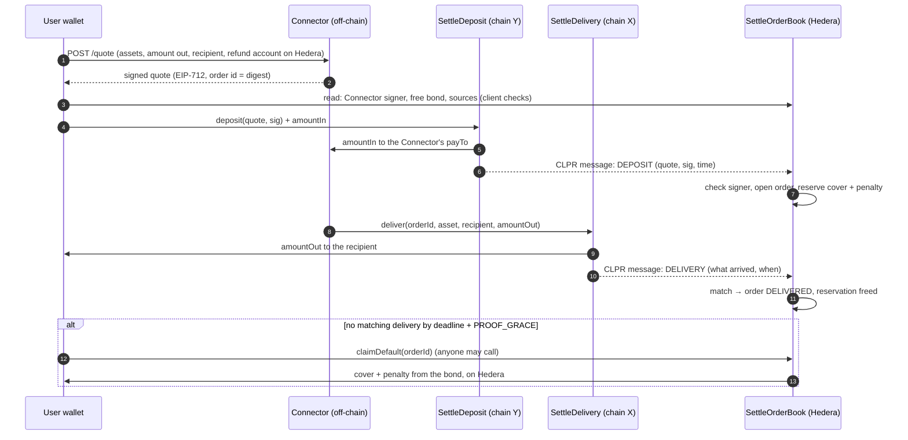

# Settle on Hedera

Settle on Hedera lets a user pay on one chain and be paid on another through a bonded **Connector**, with
the guarantee held on Hedera. The user pays the Connector on chain Y. The Connector pays the user on chain X. Both
payments are proven to an order book on Hedera. If the Connector misses the deadline, the user is paid from the
Connector's bond on Hedera, plus a penalty.

CLPR proofs only need to flow **chain → Hedera**. Nothing on chain X or Y waits for Hedera, so this works with the
verifiers that exist today, which all run chain → Hiero.

> "Connector" in this document is a bonded liquidity provider of this protocol. The CLPR messaging connector that
> pays for a message's execution on the destination is called the *CLPR connector* (`clprConnectorId`).

Status: pre-release, local networks only. No testnet deployment yet.

## Flow



## Contracts (`src/settle/`)

| Contract | Ledger | Role |
| --- | --- | --- |
| `SettleTypes` | all | Quote and delivery structs, EIP-712 hashing, message encoding |
| `SettleDeposit` | each chain users pay on | Checks the quote (this chain, this contract, the user, expiry, signature) and the exact amount, pays the Connector's `payTo`, sends the DEPOSIT message. Holds no funds. Each quote once. |
| `SettleDelivery` | each chain Connectors deliver on | Pays a recipient (native or ERC-20), measures what arrived, sends the DELIVERY message. Holds no funds. |
| `SettleOrderBook` | Hedera | Connectors, bonds (HBAR or HTS tokens such as USDC), orders, defaults, payment provers |
| `ISettlePaymentProver` | Hedera | Interface for chains without a CLPR Service (Bitcoin, XRPL, Stellar): proves a plain payment that carries the order id |

All are immutable. The order book's admin can only add sources and payment provers (below); it cannot touch
bonds or orders.

### The quote

The Connector signs an EIP-712 `Quote` under the order book's domain
(`{name: "ClprSettle", version: "1", chainId: <Hedera>, verifyingContract: <order book>}`). Its digest is the
order id everywhere. Fields: `connector` (its Hedera account), `srcLedger`, `depositApp`, `user`, `payTo`,
`assetIn`, `amountIn`, `dstLedger`, `assetOut`, `recipient`, `amountOut`, `coverAsset`, `coverAmount`, `refundTo`
(the user's Hedera account), `issuedAt`, `expiry`, `deadline`, `salt`. Ledgers are `keccak256(CAIP-2 id)`;
chain-side accounts and assets are 32 bytes (an EVM address left-padded; the native coin is zero), so the same
format covers non-EVM chains. `sdk/test/vectors/settle-quote.json` is a cross-language vector (digest, signature,
both message encodings) that the Connector service and the Clip Wallet client check against.

`cover` is what the Connector promises in a bond asset if it defaults; there is no price oracle. The order book adds
`PENALTY_BPS` of it: `owedOnDefault = cover + cover × PENALTY_BPS / 10,000`.

### Orders

| Status | Reached by |
| --- | --- |
| `OPEN` | A DEPOSIT message (or a payment proof) for a quote signed by the Connector's signer. Reserves `owedOnDefault` from the Connector's bond. |
| `DELIVERED` | A DELIVERY proven on `dstLedger` with the order id, `assetOut`, `recipient`, `amount ≥ amountOut` and `deliveredAt ≤ deadline` (chain X clock). Frees the reservation. |
| `DEFAULTED` | `claimDefault` after `deadline + PROOF_GRACE` (Hedera clock), by anyone. Pays the reservation to `refundTo`. |
| `CANCELLED` | `cancelOrder` by the Connector before delivering. Pays the same as a default, at once. |
| `REJECTED` | The quote was not signed by the Connector's signer, the Connector is unknown, or the message came from another ledger's or contract's source. Nothing is reserved. |

Statuses only move forward; `DELIVERED`, `DEFAULTED`, `CANCELLED` and `REJECTED` are final. A repeated DEPOSIT for
an order id is ignored (`DuplicateDeposit`). A DELIVERY that arrives before its DEPOSIT is kept as a hash
(`deliverySeen`) and anyone closes the order with `closeWithRecordedDelivery` once it is open. A DELIVERY after a
default or cancel is recorded (`LateDelivery`) and moves nothing.

Processing a CLPR message makes no external call and never reverts for a well-formed message from a registered
sender, so a message cannot be consumed by a revert of the order book.

### Bonds and capacity

Per Connector and asset: `total = reserved + pendingWithdraw + free`. Capacity is the bond.

- `postBond` adds to `total`. `requestWithdraw` moves free bond into `pendingWithdraw`, where it backs no new
  order; `executeWithdraw` pays it out after `WITHDRAW_DELAY`.
- An order reserves `owedOnDefault` from free bond first, then from a pending withdrawal, so a deposit made
  against a quote signed before the request is still covered. If both are not enough, the order opens with what
  could be reserved, `CoverShortfall` is emitted and the Connector's `shortfalls` count goes up. Clients check
  `freeCapacity` before depositing.
- A rotated quote signer stays valid for quotes issued before the rotation that expire within `MAX_QUOTE_TTL`,
  so a Connector cannot void quotes it signed by rotating; one rotation per `MAX_QUOTE_TTL`.
- A quote whose cover asset is not a bond asset opens with nothing reserved (the Connector signed it) and counts
  as a shortfall.
- Payouts are pushed (native with a 30,000 gas stipend); a failed push, e.g. an HTS token the account is not
  associated with, is credited to `owed` for `withdrawOwed`.

### Sources and payment provers

A **source** is a CLPR Channel to Hedera plus the two contracts allowed to speak for its ledger
(`proposeSource(channelId, ledger, depositSender, deliverySender)`). The order book accepts a DEPOSIT only from the
deposit contract, a DELIVERY only from the delivery contract, and checks that the quote names that ledger and that
contract. A **payment prover** (`proposeProver(ledger, prover)`) serves chains with no CLPR Service:
`openByPayment(quote, sig, proof)` and `closeByPayment(orderId, proof)` accept a final payment that carries the
order id, and each `(ledger, txId)` is used once.

Both take effect after `SOURCE_NOTICE`, at most one of each per ledger, and are never replaced or removed. The
admin can hand over (`transferAdmin` / `acceptAdmin`) or give up the role (`renounceAdmin`).

### Parameters

| Parameter | Meaning | e2e / tests | Floor |
| --- | --- | --- | --- |
| `PENALTY_BPS` | Penalty on default, of the cover | 1000 (10 %) | at most 5000 |
| `WITHDRAW_DELAY` | Request → payout of a bond withdrawal | 1 day | 1 hour |
| `PROOF_GRACE` | Time after the deadline for a delivery proof to reach Hedera | 30 min | — |
| `MAX_QUOTE_TTL` | Longest quote a rotated-out signer still covers | 10 min | > 0 |
| `SOURCE_NOTICE` | Delay before a new source or prover is active | 1 day | 1 day |

Set `WITHDRAW_DELAY` above the longest quote lifetime plus the time a deposit proof takes to reach Hedera, and
`PROOF_GRACE` above the worst delivery-proof latency, including relaying.

## Hedera specifics

- **Units.** Inside Hedera's EVM, native value is in tinybars (8 decimals). HBAR bonds and covers are tinybars.
- **HTS tokens** (USDC) are used through their ERC-20 facade. The order book must be associated with each HTS cover
  asset: `associateCoverAssets()` calls the HTS system contract (`0x167`). A user's `refundTo` that is not
  associated is credited, not paid, until it associates and calls `withdrawOwed`.
- **Gas.** Every order-book step fits in one transaction well under Hedera's 15M gas limit (tables below).
- **Trace size.** A Hedera consensus node fails a transaction whose serialized call trace is above
  `contracts.maxSerializedTraceDataBytes` (262,144 B), even though the EVM finished it. The DEPOSIT message carries
  the whole quote and signature (about 0.7 KB), and a bundle repeats it in several call frames, so a bundle's trace
  grows by about 12 KB per deposit message. `script/settle-e2e/run.sh` runs `script/deploy/trace-size.mjs` on every
  transaction on H; relayers should cap bundles to Hedera at 12 messages (the Connector service's default
  `relay.maxMessagesPerBundle`), which keeps the trace under about 60 % of the limit and the gas near 10M.

## Measurements

From `script/settle-e2e/run.sh` (anvil, reference ClprService, native assets, E2EVerifier):

| Step | Ledger | Gas | Hedera trace estimate |
| --- | --- | ---: | ---: |
| `SettleDeposit.deposit` (user) | Y | 1,432,391 – 1,483,667 | — |
| `SettleDelivery.deliver` (Connector, native) | X | 685,955 – 771,467 | — |
| `submitBundle`, 1 DEPOSIT message (opens the order) | H | 1,025,582 – 1,056,031 | 22,292 B (8.5 %) |
| `submitBundle`, 1 DELIVERY message (closes the order) | H | 590,657 – 632,581 | 14,500 B (5.5 %) |
| `submitBundle`, 5 DEPOSIT messages | H | 4,328,991 | 70,084 B (26.7 %) |
| `submitBundle`, 5 DELIVERY messages | H | 2,196,697 | 45,572 B (17.4 %) |
| `submitBundle`, acknowledgements only | H | 156,250 – 161,598 | 6,428 B (2.5 %) |
| `claimDefault` | H | 78,077 | 900 B (0.3 %) |
| `closeWithRecordedDelivery` | H | 48,272 | 1,332 B (0.5 %) |
| `register` / `postBond` (HBAR) / `proposeSource` | H | 67,975 / 50,804 / 141,791 | < 0.5 % |

Contract sizes (runtime): `SettleOrderBook` 16,175 B, `SettleDeposit` 4,315 B, `SettleDelivery` 2,075 B.

## Tests and the end-to-end run

```sh
forge test --match-path 'test/settle/*'   # 75 tests: unit, fuzz, invariants, three-ledger integration, vector
script/settle-e2e/run.sh                   # three anvil chains, four scenarios, gas and Hedera trace size
(cd services && pnpm exec vitest run connector/test)   # reference Connector service
```

- `test/settle/SettleOrderBook.t.sol`: admin and sources, bonds and withdrawals, every rejection reason, message
  authentication, duplicates, delivery matching, delivery before deposit, defaults at the boundary, cancel, push
  failures and pull, HTS-like tokens, payment provers, signer rotation, fuzzing of timing, matching, reservation
  and signature malleability.
- `test/settle/SettleDepositDelivery.t.sol`: every Deposit and Delivery check, fee-on-transfer tokens, codec round
  trips.
- `test/settle/SettleInvariants.t.sol`: the order book holds exactly the bonds plus credited payouts; reserved plus
  pending withdrawals never exceed a bond and equal the open orders' reservations; each order is paid at most once,
  exactly its reservation, and only on default or cancel; statuses only move forward (with wrongly signed,
  replayed, mismatched and late messages in the mix).
- `test/settle/SettleIntegration.t.sol`: the flows on three reference ClprService instances, a resubmitted bundle,
  a tampered quote, a Connector that delivers short or to someone else.
- `script/settle-e2e/run.sh`: three anvil chains; the reference Connector service quotes, delivers, relays and closes.
  Scenarios: delivered; Connector misses the deadline and the user is paid on H; the delivery proof arrives first;
  five deposits at once in partial bundles of at most three messages.

**Test only.** The integration tests and the e2e use the CLPR repo's `E2EVerifier` on every Channel, and the
Connector service's `e2e-test-only` relay. They decode bundles and check no proof. `TestPaymentProver` returns
whatever the test registered. None of them may be used on a live network.

## Reference Connector service

`services/connector` (see its README): HTTP quotes (`POST /quote`, `GET /info`), EIP-712 signing, capacity checks
that include issued-but-not-yet-opened quotes, a deposit watcher, delivery, bond management (register, post,
withdraw), closing orders with recorded deliveries and, for local networks only, the test relay.

## Gaps

- **No testnet deployment** in this stream.
- **Verifier-specific proof submission** is a pluggable `ProofRelay` in the service; only the test relay exists.
- **Payment provers** for Bitcoin, XRPL and Stellar: the interface and the order-book paths exist and are tested
  with `TestPaymentProver`, but no production prover exists. The CLPR verifiers on those chains prove messages
  from a CLPR outbox account, not arbitrary payments; a prover needs their inclusion logic plus payment parsing
  (amount, destination, memo or OP_RETURN with the order id).
- **One-way Channels.** Settle needs messages only chain → Hedera, but the reference ClprService counts a chain's
  sent messages until Hedera acknowledges them, and stops sending at `maxQueueDepth` (and at the CLPR connector's
  `connectorQueueQuotaPct` share of it). Until there is a Hedera → chain verifier, or a receive-only Channel mode in
  CLPR, a chain-side Settle contract can send only that many messages over its Channel. The e2e relays acknowledgements back with the test verifier.
- **Quote-time capacity** is not reserved on-chain; concurrent users can over-subscribe a Connector (counted as
  shortfalls). Clients check `freeCapacity` just before depositing.
- **Native HBAR via the JSON-RPC relay**: the Connector service does not convert weibars to tinybars for HBAR
  bonds; ERC-20 (HTS) bonds and local runs are unaffected.
