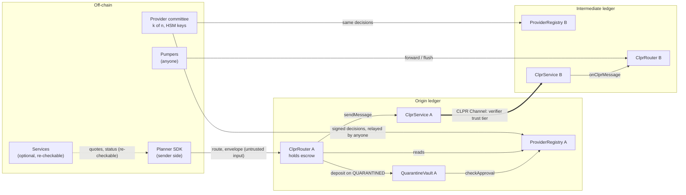
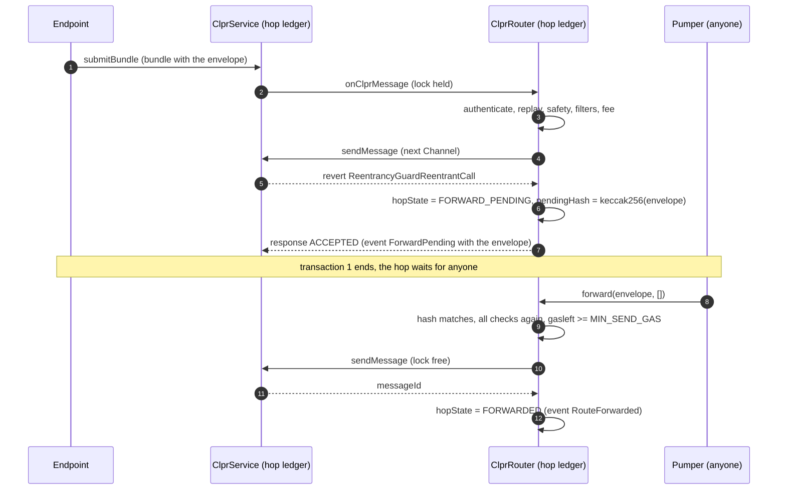

# Threat model

This document covers CLPRouter phase 1: `ClprRouter`, `ProviderRegistry`, `QuarantineVault`, the libraries they
link (`RouteCodec`, `RouteLogic`, `Caip`), the planner SDK (`sdk/`) and the optional services (`services/`). The
CLPR layer under it (ClprService, verifiers, Connectors, endpoints) is out of scope except where CLPRouter depends on
its behaviour. Everything here refers to the code at the commit this file was last changed in.

Severity labels in this document: **High** (loss or theft of funds, or forged delivery on a strict route),
**Medium** (funds held or refunded wrongly, forged status, or a broken safety property under stated conditions),
**Low** (liveness, cost or information exposure with a workaround).

## 1. Assets

| Asset | Where it lives | What protects it |
| --- | --- | --- |
| Escrow and fee budget of a route | `ClprRouter` on the origin ledger, `routes[routeId]` | Settled once, only on an authenticated receipt or `reclaim` after the deadline plus `RECLAIM_GRACE` |
| Quarantined funds | `QuarantineVault` on the ledger that held them | Committee decision per release; fixed beneficiaries; recovery notice and challenge window |
| Unpushed payments | `ClprRouter.owed[account]` | Only the account itself can `withdraw` |
| Integrity of a routed message (payload, origin, sender, recipient) | Envelope on every hop | Each Channel's CLPR verifier, plus each Router's previous-hop authentication |
| Integrity of a receipt | Receipt envelope on the way back | Same as above, plus the origin's hop-list commitment check (strict routes) |
| Registry state (certifications, trust-tier labels, disables, blacklist, committee, contact) | `ProviderRegistry` on every ledger | k (or k + 1) committee signatures; strict nonce order; notice and lapse periods |
| Committee signing keys | Members' HSMs (off-chain) | Key ceremony and custody (`docs/provider-committee-runbook.md`) |
| Forward-trigger key (services) | Environment of the services process | Test keys only; the trigger refuses non-local RPC URLs |
| Off-chain personal data under the ISO 20022 and MiCA filters | Never on-chain in clear; ciphertext or hashes in the payload | SDK encryption to the destination institution's key; `assertNoClearPersonalData` |

## 2. Actors

| Actor | Trusted for | Can do | Cannot do |
| --- | --- | --- | --- |
| Sender (origin application or account) | Its own funds and choice of route | Pick any route, Routers, mode, filters and constraints; `reclaim` | Make another ledger's Router accept an envelope not addressed to it |
| Recipient / destination application | Its own logic | Accept or revert a delivery (revert gives `FAILED`) | Change the route |
| Router (honest, any version) | Executing the published code | Forward, deliver, stop, send receipts | Anything outside its code; it has no admin key |
| Router (malicious deployment) | Nothing | Anything on routes that name it: drop, alter, forge receipts | Affect routes that do not name it (previous-hop authentication) |
| CLPR verifier of a Channel | The integrity of messages over that Channel, at its trust tier | Accept a forged bundle if broken or below its claimed tier | Affect other Channels |
| Connector operator | Paying execution of messages | Refuse to pay (the hop's `sendMessage` fails or is NACKed) | Change message content |
| Endpoint / relayer | Liveness of bundles | Delay or withhold bundles | Forge bundles that the verifier accepts |
| Pumper (anyone calling `forward` / `flush`) | Nothing | Complete a pending hop at a time of its choosing; on a loose route after a NACK, choose the new tail | Complete a hop with a different envelope; fail a hop by under-funding gas (`MIN_SEND_GAS`) |
| Decision relayer (anyone calling `ProviderRegistry.submit`) | Nothing | Choose when a signed decision lands on each ledger, within `validUntil` | Change a decision; skip a nonce |
| Provider committee (k of n) | Certifications, trust-tier labels, disables, blacklist, vault releases, its own membership | See section 4 | Change Router code, fees, Channels, Connectors or verifiers; send funds to its members |
| Regulated operator (operated Router, ISO 20022 / MiCA hops) | Identity and screening at its hop | Reject a forward after screening | Redirect a route (same Router code) |
| Services operator (indexer, status API, quote service, trigger) | Nothing on-chain | Serve wrong quotes or status | Change on-chain state other than completing pending hops |

## 3. Trust boundaries

Each thick edge is a CLPR Channel and carries exactly the trust of its verifier. Every arrow into a Router is
untrusted input that the Router re-checks: the SDK's route, the CLPR-delivered envelope, a pumper's call and a
relayed registry decision.

## 4. Trust assumptions per tier

### 4.1 Verifier tiers (data path)

The envelope's `trust_floor` and `ProviderRegistry.trustTier` use one scale: 0 attested, 1 committee, 2 light
client, 3 validity proof.

| Tier | A forged message needs | What CLPRouter adds |
| --- | --- | --- |
| 0 attested | The attestor key(s) of that Channel | Nothing; a route is as strong as its weakest hop |
| 1 committee | A threshold of that Channel's committee | Same |
| 2 light client | The source chain's consensus (e.g. the sync committee signs the header) | Same |
| 3 validity proof | A sound proof system and correct circuit | Same |

- **The on-chain floor is off by default.** The SDK sets `trust_floor = 0`, at which Routers never read
  trust-tier labels. A route then depends on no provider decision for trust, and the planner's floor is advisory
  (shown as `effectiveTrustTier` in every quote). A sender who sets a floor above 0 depends on the committee's
  labels, and an unlabelled edge fails closed.
- **Hiero → chain edges have no verifier yet** (section 7.2). No tier can be claimed for them, and no route can leave
  Hiero on a live network today.

### 4.2 Router tier

- A hop accepts an envelope only from the Router named for the previous hop, over the named Channel, whose CLPR peer
  is the named ledger (`ClprRouter._validateInbound`). So a malicious Router affects only routes that name it.
- The origin, sender and payload the destination sees are as good as every Router on the route. A sender who picks
  an unknown Router trusts it completely for that route.
- Routers are immutable. A buggy version is switched off by a `DISABLE` of `TARGET_ROUTER_VERSION`, and a new version
  is deployed beside it (`docs/deployment.md`).

### 4.3 Provider committee tier

| Action | Signatures | Takes effect | Bound |
| --- | --- | --- | --- |
| `CERTIFY`, `UNCERTIFY`, `TRUST_TIER` | k | After `CERT_NOTICE` (raise) or `REMOVAL_NOTICE` (lower, remove) | Pinned versions protect routes in flight (certifications only) |
| `DISABLE` | k + 1 | Immediately | Lapses after `DISABLE_LAPSE` unless renewed |
| `ENABLE` | k | After `REENABLE_NOTICE` | — |
| `BLACKLIST` | k + 1 | Immediately | Lapses after `BLACKLIST_LAPSE` unless renewed |
| `DELIST` | k | Immediately | — |
| `COMMITTEE`, `CONTACT` | k | Immediately; `COMMITTEE` bumps the epoch | k ≥ 1 and k + 1 ≤ n enforced |
| Vault `nameRecovery` | k | Releasable after `RECOVERY_NOTICE + CHALLENGE_WINDOW` | Sender or recipient may challenge |
| Vault `release` | k | Immediately (recovery: after the window) | Only to the deposit's sender, recipient or unchallenged recovery address; never a provider account |

`COMMITTEE` needs only k and applies at once, so k keys can replace the committee with keys they control and then
meet any threshold, k + 1 included (audit finding RV-01 in `docs/audit/`). The k / k + 1 split is a guard against
honest mistakes, not against k compromised keys.

Recommended values (spec and tests): k ≥ 3, `CERT_NOTICE` 7 days, `REMOVAL_NOTICE` 72 hours, `REENABLE_NOTICE`
7 days, `DISABLE_LAPSE` 7 days, `BLACKLIST_LAPSE` 30 days, `RECOVERY_NOTICE` 3 days, `CHALLENGE_WINDOW` 7 days.

### 4.4 Off-chain components

The SDK, the quote service and the status API add no trust. A wrong quote can make a route fail or cost more; it
cannot redirect funds, because every hop re-checks on-chain. The status API reports the block numbers and registry
versions each answer is built from, so a client can re-check it against an RPC node.

## 5. Attack surfaces

| # | Surface | Entry point | Main checks |
| --- | --- | --- | --- |
| S1 | Route submission | `ClprRouter.send` | Structure, deadline, fees vs budget and `max_fee`, safety of every edge, ledger and Router, filters at the current registry version, blacklist (sender, recipient, payee), loose routes carry no value |
| S2 | Inbound envelope | `onClprMessage` (only the Service) | Version, structure, addressed to this Router, previous Router and Channel, Channel peer ledger, replay, deadline |
| S3 | Inbound CLPR Response | `onClprResponse` (only the Service) | Known outbound message; NACK marks the hop for completion |
| S4 | Pending hop completion | `forward(envelope, newTail)`, `flush(...)` | Exact envelope hash; all checks re-run; `MIN_SEND_GAS`; tail only on loose routes |
| S5 | Receipt at the origin | `_settle` via `onClprMessage` | First-hop Router and Channel, hop-list commitment (strict), exact reverse path (strict, no explicit receipt path) |
| S6 | Refund without receipt | `reclaim` | Status `PENDING` and `block.timestamp > deadline + RECLAIM_GRACE` |
| S7 | Pull payments | `withdraw` | Caller's own balance |
| S8 | Committee decisions | `ProviderRegistry.submit` | Action, `validUntil`, evidence hash, nonce = version + 1, digest unused, epoch, sorted distinct member signatures, threshold |
| S9 | Vault | `deposit`, `nameRecovery`, `challengeRecovery`, `release` | Case id; committee approval; beneficiary rules; window; one release per deposit |
| S10 | Application callbacks | `onRouteMessage`, `onRouteNotice`, `onRouteReceipt` | Fixed gas stipend `APP_GAS`; notices and receipt callbacks are best effort |
| S11 | Envelope bytes | `RouteCodec.decodeEnvelope` / `decodeReceipt` | Strict proto3 decoding; fuzzed (`testFuzz_decode_neverPanics`) |
| S12 | Services HTTP API | `GET /routes/:id`, `/accounts/:caip10/notices`, `/registry`, `/stream`, `/pending`, `POST /quote` | Read-only on-chain; unauthenticated; bind to localhost by default |
| S13 | Forward trigger | `services/src/trigger.ts` | Key from env only; refuses non-local RPC; simulates before sending |
| S14 | Supply chain | CI, npm dependencies, Docker base image, git submodule | SHA-pinned actions, lockfiles, `pnpm audit`, OSV-Scanner, CodeQL, SBOM and provenance on releases |

## 6. Threats and mitigations

| # | Threat | Mitigation | Residual |
| --- | --- | --- | --- |
| T1 | Replay of an envelope on the same Router | Every route id seen is remembered (`hopState`, `routes`); a repeat reverts `RouteReplayed` | Route ids and receipt ids share one namespace with caller-chosen ids at `send`, so an id can be squatted (audit H-01, M-01) |
| T2 | Loop or unbounded route | No ledger twice; at most `max_hops` (default 3, cap 8); receipts never trigger receipts | None known |
| T3 | Envelope injected by a non-Router | Only the Service may call `onClprMessage`; previous Router, Channel and peer ledger must match the envelope | Bounded by the Channel's verifier (4.1) |
| T4 | Forged receipt to release escrow | Strict routes: commitment to the hop list and the exact reverse path, first hop authenticated; DELIVERED only from the destination | Loose routes: no commitment (R5). Strict routes with an explicit `receipt_path` (audit H-02) |
| T5 | Fee exhaustion or overcharge | Fees checked against the budget and `max_fee` at send and at every hop; payouts only for hops before the reporting one and never above the budget | None known |
| T6 | Griefing a hop by under-funding gas | `MIN_SEND_GAS`: a permissionless `forward` below it reverts with `InsufficientGas`; inside delivery the hop stays pending; out-of-gas inside `sendMessage` is not treated as a verdict | `MIN_SEND_GAS` must be set per ledger from measurement (R9) |
| T7 | Funds stranded when the way back is cut | `reclaim` after the deadline plus grace refunds escrow and budget | Late-receipt ordering (R4) |
| T8 | Reentrancy | `ReentrancyGuardTransient` on every external entry; state written before `sendMessage`, app calls and vault deposits; pushes capped at 30,000 gas with fallback to `owed` | None known |
| T9 | Exploiter moves funds through CLPRouter | Blacklist (k + 1) checked at the origin, at every hop and again at settlement; funds go to the vault | Covers only CLPRouter; fresh addresses evade it |
| T10 | Compromised verifier or ledger | `DISABLE` of the edge or ledger (k + 1, immediate); messages already over a disabled inbound edge are not forwarded | Messages delivered before the disable stand |
| T11 | Malicious Router deployment | Previous-hop authentication; `DISABLE` of `TARGET_ROUTER`; planner uses known deployments | Senders who name it trust it fully |
| T12 | Certification change on routes in flight | Routes pin the registry version; a registry behind the pin fails closed | Disables and blacklist entries are deliberately not pinned |
| T13 | Registry state diverges between ledgers | Strict nonce order; same digest on every ledger | Relaying lag (R7) and re-signed nonces (R8) |
| T14 | Committee key compromise | k / k + 1 thresholds; epochs; notices; lapse; vault beneficiary rules; all actions public | R2, R3 |
| T15 | Personal data on-chain | Under ISO 20022 / MiCA the SDK encrypts to the destination institution (X25519, XChaCha20-Poly1305) and checks every clear field | Routes without those filters carry payloads in plaintext on every ledger they cross |
| T16 | Wrong quote or status from services | Every answer carries block numbers and registry versions; every hop re-checks | None on-chain |
| T17 | Trigger key misuse | Test key from env; refuses to sign against non-local RPC; no key in config, image or logs | Production pumping needs its own key handling (R1) |
| T18 | Malicious dependency or CI action | Lockfiles, SHA-pinned actions, Dependabot, audits, SBOM and provenance attestations | Upstream compromise before pinning |

## 7. Residual risks

### R1. Two-transaction forwarding (Medium, liveness and value)

The reference Solidity `ClprService` guards `submitBundle` and `sendMessage` with one transient reentrancy lock. A
Router cannot call `sendMessage` while it is being delivered a message, so every intermediate hop and every receipt
takes a second transaction (`forward` or `flush`) by anyone.

- **Liveness.** A hop moves only when someone pumps it. Nobody is paid for pumping: hop fees go to the `fee_payee` of
  each hop at settlement, not to the caller. If nobody pumps before the deadline, the next hop stops the route with
  `EXPIRED` and the origin refunds; if the receipt is also stuck, the sender reclaims after the deadline plus
  `RECLAIM_GRACE`. Funds are not lost, but the route fails.
- **Timing.** A pumper chooses when the hop goes out, within the deadline. It cannot change the envelope (hash
  check) or fail the hop by sending too little gas (`MIN_SEND_GAS`, `InsufficientGas`).
- **Cost.** 1.46M to 1.65M gas per pumped step on the reference Service (README gas table, anvil), paid by the pumper.
- **Mitigations in place.** `services/` indexes `ForwardPending` and `OutboxQueued` and serves calldata at
  `GET /pending`; its trigger can submit them on local networks. Routers send directly in the delivery transaction on
  any Service that allows it (`test_forwardsInsideDelivery_andDeductsFee`).
- **What closes it.** A CLPR Service that lets an application call `sendMessage` during dispatch (ADR Appendix A), or a
  funded pumper network per ledger. Until then, integrators and operators must run or contract a pumper.

### R2. Committee can move quarantined funds to a recovery address (Medium)

`nameRecovery` and `release` need k signatures. A recovery address may be any address that has never been a
committee member, the registry or the vault. A committee with k keys (honest or compromised) can therefore name a
fresh address and release a deposit to it after `RECOVERY_NOTICE + CHALLENGE_WINDOW`, unless the deposit's sender or
recipient challenges in time. A challenge blocks only that address; the committee can name another and start a new
window. The README's "funds could not be taken" holds only if a party watches and challenges every naming.

Naming the same address again also clears an earlier challenge (audit RV-08).

Mitigations: the window is public (`RecoveryNamed`), the services index it, the runbook requires published
evidence and legal sign-off before any naming. Consider requiring k + 1 for `VAULT_NAME_RECOVERY` in the next Router
generation.

### R3. A blacklisted party can block recovery indefinitely (Medium, design)

The parties who can challenge a recovery naming are the deposit's sender and recipient. When the sender is the
exploiter, it can challenge every recovery naming, so the funds can only go back to the sender or to the recipient.
Victims who are neither cannot be paid from the vault. Because anyone can create a deposit under a case id, others can join a case and challenge too (audit RV-09). This
needs the legal review the spec already calls for (runbook section 9).

### R4. Late receipt after reclaim (Medium, value routes)

`reclaim` opens at `deadline + RECLAIM_GRACE`. The destination never delivers after the deadline, but the `DELIVERED`
receipt can still be on its way (pending pumps, slow bundles). If the sender reclaims first, the escrow returns to
the sender while the destination application has already acted, and the late receipt is ignored
(`test_reclaim_onlyAfterDeadlinePlusGrace_thenLateReceiptIgnored`). Set `RECLAIM_GRACE` above the worst-case receipt
latency of the slowest return path, including pumping, and keep pumpers running.

### R5. Loose routes after a NACK: anyone chooses the new tail (Medium, data routes)

When a loose route's forward is rejected, anyone may call `forward(envelope, newTail)`. The tail must start at this
Router, end at the destination ledger, satisfy the structure rules and pass the checks of each following hop, but the
caller picks the Routers in it. A malicious Router named in that tail can then alter the payload or the stamped
fields before the destination, and can forge the status receipt (loose routes have no hop-list commitment). Loose
routes carry no value (`ValueRoutesMustBeStrict`), so no funds are at risk, but data integrity is.

The envelope's optional `origin_signature` is not checked on-chain and is not passed to the destination application
(`onRouteMessage` does not include it). Applications that need end-to-end integrity on loose routes must sign inside
the payload, or use strict routes.

### R6. Hiero proof-source gap (High for live use; not deployable)

Every CLPR verifier in this programme runs chain → Hiero. The Hiero → chain direction has no proof source: block node
v0.38.0 (the version Solo deploys) ships no `ProofService.getStateProof` (HIP-1081) plugin, so no verifier on another
ledger can check Hiero state. The e2e runs use the CLPR repo's `E2EVerifier`, which decodes bundles and checks no
proof, on every leg (`script/e2e/run.sh`, `script/e2e-hiero/run.sh`).

Consequences: a route can reach Hiero but cannot leave it on a live network. Any deployment that wires an
`E2EVerifier` (or any non-verifying stub) on a live Channel would let anyone forge envelopes and receipts over it,
including `DELIVERED` receipts that release escrow. The deployment guide forbids it, and the planner marks
Hiero → chain edges `projected`. This closes when a block node serves state proofs for EVM storage slots and the CLPR
`HieroVerifier` is deployed for those Channels; the Router needs no change.

### R7. Registry lag between ledgers (Low)

A decision applies on a ledger only when someone relays it there. Until then that ledger's Router does not see a
new disable or blacklist entry, and a filtered route pinned to a newer version fails closed there. Mitigation: the
runbook relays every decision to every ledger at once and checks `version()` everywhere.

### R8. Re-signing a nonce can fork registry state (Low, procedural)

Decisions must land in nonce order. If a decision expires (`validUntil`) before it reaches some ledger, the
committee signs a replacement with the same nonce. If the replacement differs from the original in anything but
`validUntil`, ledgers that applied the original and ledgers that apply the replacement hold different states under
the same version number. The runbook forbids changing anything but `validUntil` in a replacement.

### R9. Gas parameters are per-ledger constants (Low)

`MIN_SEND_GAS` and `APP_GAS` are immutable. If a ledger's gas schedule changes so that `sendMessage` costs more than
`MIN_SEND_GAS`, hops still cannot be failed by under-funding inside a permissionless `forward` (an out-of-gas inside
the call is detected), but deliveries may defer more often. A new Router deployment is the only fix.

### R10. Vault decisions are not bound to a ledger (Low)

Vault decisions are signed over the same ledger-independent digest as registry decisions, and each vault keeps its
own `used` set and its own deposit counter. A `release` for deposit N of case C can be relayed to another ledger's
vault, where it releases that vault's deposit N if it belongs to the same case, to that deposit's own sender or
recipient. A `nameRecovery` names the same address for the case on every ledger it is relayed to. Mitigation: case
ids per ledger, or a ledger id in the vault payload in the next generation.

### R11. Contract size margin (Low, engineering)

`ClprRouter` is 24,477 B against the EIP-170 limit of 24,576 B (99 B margin), built with `optimizer_runs = 200`. Any
fix to the Router may need code moved into `RouteLogic` or `RouteCodec`. CI fails a build over the limit.

### R12. No confidentiality without filters (Low, by design)

CLPR gives integrity, not confidentiality. A payload without the ISO 20022 or MiCA filter is plaintext on every ledger
the route crosses, not only the two ends.

## 8. Out of scope

- The CLPR Service, verifiers, Connectors and endpoints (`lib/clpr-smart-contracts`), beyond the reentrancy-lock
  behaviour in R1.
- Legal compliance of operators; the filters supply controls, not a licence.
- Per-hop escrow and asset routing (phase 4).
