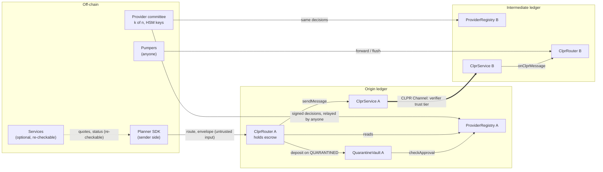
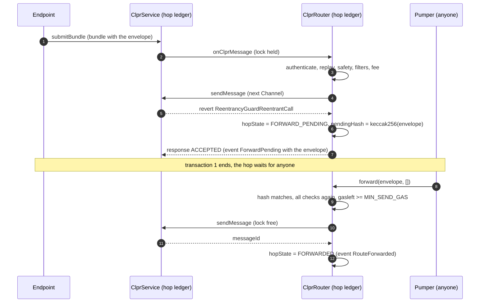

# Threat model

This document covers CLPRouter phase 1: `ClprRouter`, `ProviderRegistry`, `QuarantineVault`, the libraries they
link (`RouteCodec`, `RouteLogic`, `Caip`), the planner SDK (`sdk/`) and the optional services (`services/`), and
settle on Hedera (`src/settle/`, `services/connector`, section 8). The
CLPR layer under it (ClprService, verifiers, Connectors, endpoints) is out of scope except where CLPRouter depends on
its behaviour. Everything here refers to the code at the commit this file was last changed in.

Severity labels in this document: **High** (loss or theft of funds, or forged delivery on a strict route),
**Medium** (funds held or refunded wrongly, forged status, or a broken safety property under stated conditions),
**Low** (liveness, cost or information exposure with a workaround).

## 1. Assets

| Asset | Where it lives | What protects it |
| --- | --- | --- |
| Escrow and fee budget of a route | `ClprRouter` on the origin ledger, `routes[routeId]` | Settled once, only on an authenticated receipt or a two-phase `reclaim` after the deadline plus `RECLAIM_GRACE` per edge of the way back |
| Quarantined funds | `QuarantineVault` on the ledger that held them | Deposits only from the bound Router; committee decision per release, bound to this vault; fixed beneficiaries; k + 1 to name a recovery address, notice, challenge window and supermajority override |
| Unpushed payments | `ClprRouter.owed[account]` | Only the account itself can `withdraw` |
| Integrity of a routed message (payload, origin, sender, recipient) | Envelope on every hop | Each Channel's CLPR verifier, which the provider registry must approve for that Channel direction, plus each Router's previous-hop authentication |
| Integrity of a receipt | Receipt envelope on the way back | Same as above, plus the origin's hop-list commitment check (strict routes) |
| Registry state (certifications, Channel approvals and trust-tier labels, disables, blacklist, committee, contact) | `ProviderRegistry` on every ledger | k, k + 1 or supermajority committee signatures; decisions form a hash chain bound to the deployment id; notice and lapse periods |
| Committee signing keys | Members' HSMs (off-chain) | Key ceremony and custody (`docs/provider-committee-runbook.md`) |
| Forward-trigger key (services) | Environment of the services process | Test keys only; the trigger refuses non-local RPC URLs |
| Off-chain personal data under the ISO 20022 and MiCA filters | Never on-chain in clear; ciphertext or hashes in the payload | SDK encryption to the destination institution's key; `assertNoClearPersonalData` |

## 2. Actors

| Actor | Trusted for | Can do | Cannot do |
| --- | --- | --- | --- |
| Sender (origin application or account) | Its own funds and choice of route | Pick any route over approved Channels, its Connectors, mode, filters and constraints; `reclaim` | Make another ledger's Router accept an envelope not addressed to it; route over a Channel the registry does not approve in both directions |
| Recipient / destination application | Its own logic | Accept or revert a delivery (revert gives `FAILED`) | Change the route |
| Router (honest, any version) | Executing the published code | Forward, deliver, stop, send receipts | Anything outside its code; it has no admin key |
| Router (non-canonical deployment) | Nothing | Nothing on CLPRouter routes: every hop, receipt path and loose tail must name each ledger's canonical Router | Be named in a route (`NonCanonicalRouter`) |
| Channel operator (anyone may open a CLPR Channel, with a verifier of its choice) | Nothing, until the registry approves the Channel | Open a Channel to any ledger and stamp any sender through its own verifier | Make a Router accept, forward or settle anything over a Channel direction the registry does not approve with exactly that verifier |
| CLPR verifier of an approved Channel | The integrity of messages over that Channel, at its trust tier | Accept a forged bundle if broken or below its claimed tier | Affect other Channels; keep its approval if replaced (the label names its address and code hash) |
| Connector operator | Paying execution of messages | Refuse to carry a message (the hop's `sendMessage` fails or is NACKed; a refused receipt waits in the outbox) | Change message content; hold a receipt back while any other Connector of its Channel carries it |
| Endpoint / relayer | Liveness of bundles | Delay or withhold bundles | Forge bundles that the verifier accepts |
| Pumper (anyone calling `forward` / `flush` / `requeue`) | Nothing | Complete a pending hop at a time of its choosing; pick which Connector of the Channel carries a queued receipt; on a loose route after a NACK, choose the new tail (canonical Routers only) | Complete a hop with a different envelope; fail a hop by under-funding gas (`MIN_SEND_GAS`); settle a route without its `onRouteReceipt` callback (`APP_GAS` or the call reverts) |
| Decision relayer (anyone calling `ProviderRegistry.submit`) | Nothing | Choose when a signed decision lands on each ledger | Change a decision; skip a nonce; apply a decision that does not extend the ledger's head |
| Provider committee (k of n) | Certifications, Channel approvals and trust-tier labels, disables, blacklist, vault releases, its own membership | See section 4 | Change Router code, fees, Channels, Connectors or verifiers; approve a Channel direction with a verifier other than the one the receiving ledger uses; send funds to its members |
| Router deployer owner | Deploying each ledger's canonical Router once | For a ledger without a Router yet: deploy it, choosing its CLPR Service (which must report that ledger's chain id) and registry and vault instances (which must carry the code and initial committee the deployer pins) | Choose the Router's code, gas or grace parameters; replace or administer a deployed Router |
| Regulated operator (operated Router, ISO 20022 / MiCA hops) | Identity and screening at its hop | Reject a forward after screening | Redirect a route (same Router code) |
| Services operator (indexer, status API, quote service, trigger) | Nothing on-chain | Serve wrong quotes or status | Change on-chain state other than completing pending hops |

## 3. Trust boundaries

Each thick edge is a CLPR Channel and carries exactly the trust of its verifier. Every arrow into a Router is
untrusted input that the Router re-checks: the SDK's route, the CLPR-delivered envelope, a pumper's call and a
relayed registry decision.

## 4. Trust assumptions per tier

### 4.1 Verifier tiers (data path)

The envelope's `trust_floor` and `ProviderRegistry.trustTier` use one scale: 0 attested, 1 committee, 2 light
client, 3 validity proof.

| Tier | A forged message needs | What CLPRouter adds |
| --- | --- | --- |
| 0 attested | The attestor key(s) of that Channel | Nothing; a route is as strong as its weakest hop |
| 1 committee | A threshold of that Channel's committee | Same |
| 2 light client | The source chain's consensus (e.g. the sync committee signs the header) | Same |
| 3 validity proof | A sound proof system and correct circuit | Same |

- **Every Channel direction must be approved.** A Router accepts an envelope only over a Channel direction into its
  ledger that the registry labels, and only if the label names exactly the verifier (address and runtime code hash)
  its CLPR Service uses for that Channel. It forwards and sends receipts only over labelled directions, and `send`
  requires both directions of every edge (the receipt comes back the other way). CLPR Channels are permissionless and
  each carries its own verifier, so without this a Channel anyone opened could stamp any Router as the sender. The
  committee's label is therefore part of every route's trust: a Channel is as strong as its verifier and as the
  committee's decision to approve it.
- **The trust floor is off by default.** The SDK sets `trust_floor = 0`, which every approved direction meets, so the
  planner's floor is advisory (shown as `effectiveTrustTier` in every quote). A floor above 0 also compares the
  labels' tiers.
- **Hiero → chain edges have no verifier yet** (section 7.2). No tier can be claimed for them, and no route can leave
  Hiero on a live network today.

### 4.2 Router tier

- Every Router of a deployment sits at its ledger's canonical CREATE2 address (`ClprRouterDeployer`), and every
  Router a route, receipt path or loose tail names must be canonical. Together with the Channel approvals above, every
  envelope on the wire was built by this code and carried over an approved Channel. Non-EVM ledgers fail closed until
  a registry-certified Router hook exists.
- The deployer's constructor fixes, for every Router it deploys, `RECLAIM_GRACE`, `APP_GAS` and `MIN_SEND_GAS`
  (range-checked) and the runtime code hash and genesis head of the registry and the code hash of the vault, and its
  address (the same on every ledger) commits to them. The owner still picks a not-yet-deployed ledger's CLPR Service
  and its registry and vault instances (T11).
- A hop accepts an envelope only from the Router named for the previous hop, over the named Channel, whose CLPR peer
  is the named ledger and whose direction into this ledger the registry approves with this ledger's verifier for it
  (`ClprRouter._validateInbound`). Nothing about an envelope over another Channel is recorded: it reverts first.
- The origin, sender and payload the destination sees are as good as every verifier on the route.
- Routers are immutable. A buggy version is switched off by a `DISABLE` of `TARGET_ROUTER_VERSION`, and a new version
  is deployed beside it (`docs/deployment.md`).

### 4.3 Provider committee tier

| Action | Signatures | Takes effect | Bound |
| --- | --- | --- | --- |
| `CERTIFY`, `UNCERTIFY` | k | After `CERT_NOTICE` (certify) or `REMOVAL_NOTICE` (uncertify) | Pinned versions protect routes in flight |
| `TRUST_TIER` (Channel approval) | k | After `CERT_NOTICE` (approve, raise the tier, or name another verifier) or `REMOVAL_NOTICE` (lower, remove) | The label names the receiving ledger's verifier (address and code hash); removing it stops the direction like a disable (R14) |
| `DISABLE` | k + 1 | Immediately | Lapses after `DISABLE_LAPSE` unless renewed |
| `ENABLE` | k | After `REENABLE_NOTICE` | — |
| `BLACKLIST` | k + 1 | Immediately | Lapses after `BLACKLIST_LAPSE` unless renewed |
| `DELIST` | k + 1 | Immediately | — |
| `CONTACT` | k | Immediately | — |
| `COMMITTEE` | Supermajority, max(k + 1, ⌈2n/3⌉) | Scheduled; the new committee takes over with its first decision after `COMMITTEE_NOTICE` | n ≥ 3, 2 ≤ k, k > n/2, k + 1 ≤ n; after the notice the outgoing committee needs a supermajority for everything |
| Vault `bindRouter` | k + 1 | Immediately, once | Afterwards only that Router can deposit |
| Vault `nameRecovery` | k + 1 | A deposit is releasable `RECOVERY_NOTICE + CHALLENGE_WINDOW` after the naming or after the deposit, whichever is later | The deposit's sender or recipient may challenge until then; a challenge is never cleared |
| Vault `release` | k (supermajority over a challenge) | Immediately (recovery: after the window; over a challenge: one more `CHALLENGE_WINDOW`) | Only to the deposit's sender, recipient or recovery address; never a provider account |

Registry decisions are EIP-712 digests over a domain whose salt is the deployment id, and each one commits to the
registry head it extends (`prevHead`), so the applied decisions form a hash chain (`headAt`). Vault decisions use their
own domain with the chain id and the vault address, so they act on one vault only. The vault takes its quorums from
the registry (`requiredSignatures`), so once a scheduled committee's notice has passed on a ledger the outgoing
committee needs a supermajority there for vault actions too.

Naming a vault recovery address needs k+1 committee signatures. Each deposit then waits `RECOVERY_NOTICE` +
`CHALLENGE_WINDOW` from the naming or from its own arrival, whichever is later, so a deposit that joins a case after
the naming gets a full window of its own. During that time the deposit's original sender or recipient can challenge,
and a challenged deposit is paid out only by a supermajority override after a further `CHALLENGE_WINDOW`. So k+1 compromised keys can redirect an unchallenged
deposit, and a supermajority can redirect any deposit. Separately, a supermajority can install any committee after
`COMMITTEE_NOTICE`, and k compromised keys can fork a ledger that hasn't yet received the next decision. Such a fork
is visible as differing `headAt` values but cannot be undone on-chain.

Recommended values (spec and tests): k ≥ 3, `CERT_NOTICE` 7 days, `REMOVAL_NOTICE` 72 hours, `REENABLE_NOTICE`
7 days, `DISABLE_LAPSE` 7 days, `BLACKLIST_LAPSE` 30 days, `COMMITTEE_NOTICE` 7 days, `RECOVERY_NOTICE` 3 days,
`CHALLENGE_WINDOW` 7 days. The constructors enforce floors (`MIN_*`), so no notice or window can be zero. The Router
deployer bounds `RECLAIM_GRACE` to 1 hour .. 30 days, `APP_GAS` to 50,000 .. 10,000,000 and `MIN_SEND_GAS` to
100,000 .. 30,000,000; set `RECLAIM_GRACE` above the worst-case latency of one receipt edge including pumping (the
testnet configuration uses 6 hours).

### 4.4 Off-chain components

The SDK, the quote service and the status API add no trust. A wrong quote can make a route fail or cost more; it
cannot redirect funds, because every hop re-checks on-chain. The status API reports the block numbers and registry
versions each answer is built from, so a client can re-check it against an RPC node.

## 5. Attack surfaces

| # | Surface | Entry point | Main checks |
| --- | --- | --- | --- |
| S1 | Route submission | `ClprRouter.send` | Structure, deadline, fees vs budget and `max_fee`, safety of every edge, ledger and Router, filters at the current registry version, blacklist (sender, recipient, payee), loose routes carry no value |
| S2 | Inbound envelope | `onClprMessage` (only the Service) | Version, structure, addressed to this Router, previous Router and Channel, Channel peer ledger, Channel direction approved with the Service's verifier for it, replay, deadline |
| S3 | Inbound CLPR Response | `onClprResponse` (only the Service) | Known outbound message; NACK marks the hop for completion |
| S4 | Pending hop completion | `forward(envelope, newTail)`, `flush(...)`, `requeue(channel, messageId)` | Exact envelope hash; all checks re-run (edge approved and not disabled); `MIN_SEND_GAS`; tail only on loose routes; a queued receipt over any Connector of its Channel; requeue only once the Service has processed the receipt message's reply without the Router receiving it |
| S5 | Receipt at the origin | `_settle` via `onClprMessage` | First-hop Router and Channel, hop-list commitment (strict), exact reverse path (strict, no explicit receipt path) |
| S6 | Refund without receipt | `reclaim` (two calls) | Status `PENDING`, no receipt held; request after `deadline + RECLAIM_GRACE × edges`, refund `RECLAIM_GRACE` later |
| S7 | Pull payments | `withdraw` | Caller's own balance |
| S8 | Committee decisions | `ProviderRegistry.submit` | Action, evidence hash, nonce = version + 1, digest extends the current head, `effectiveAt` within `MAX_NOTICE`, epoch (or the scheduled committee after its notice), sorted distinct member signatures, threshold |
| S9 | Vault | `bindRouter`, `deposit`, `nameRecovery`, `challengeRecovery`, `release` | Bound Router; case id; vault-bound committee approval, `effectiveAt` and `validUntil`; beneficiary rules; window; per-deposit challenges; one release per deposit |
| S10 | Application callbacks | `onRouteMessage`, `onRouteNotice`, `onRouteReceipt` | Exactly `APP_GAS`: if that much is not left the whole call reverts, so no caller can settle or stop a route while starving its callback; a reverting notice or receipt callback is ignored |
| S11 | Envelope bytes | `RouteCodec.decodeEnvelope` / `decodeReceipt` | Strict proto3 decoding; fuzzed (`testFuzz_decode_neverPanics`) |
| S12 | Services HTTP API | `GET /routes/:id`, `/accounts/:caip10/notices`, `/registry`, `/stream`, `/pending`, `POST /quote` | Read-only on-chain; unauthenticated; bind to localhost by default |
| S13 | Forward trigger | `services/src/trigger.ts` | Key from env only; refuses non-local RPC; simulates before sending |
| S14 | Supply chain | CI, npm dependencies, Docker base image, git submodule | SHA-pinned actions, lockfiles, `pnpm audit`, OSV-Scanner, CodeQL, SBOM and provenance on releases |

## 6. Threats and mitigations

| # | Threat | Mitigation | Residual |
| --- | --- | --- | --- |
| T1 | Replay of an envelope on the same Router | Route ids are derived by the origin Router (ledger, Router, sender, nonce); hop state and replay are keyed by (origin ledger, origin Router, id); a repeat reverts `RouteReplayed` | None known (audit H-01, M-01 fixed) |
| T2 | Loop or unbounded route | No ledger twice; at most `max_hops` (default 3, cap 8); receipts never trigger receipts | None known |
| T3 | Envelope injected by a non-Router | Only the Service may call `onClprMessage`; previous Router, Channel and peer ledger must match the envelope; the Channel direction must be approved with this ledger's verifier for it | Bounded by the approved Channel's verifier (4.1) |
| T4 | Forged receipt to release escrow | Canonical Routers only; strict routes: commitment to the hop list and the exact reverse path, first hop authenticated; `receipt_path` receipts must travel exactly the stored path; DELIVERED only from the destination | Bounded by the verifiers on the way back (4.1) |
| T5 | Fee exhaustion or overcharge | Fees checked against the budget and `max_fee` at send and at every hop; payouts only for hops before the reporting one and never above the budget | None known |
| T6 | Griefing a hop by under-funding gas | `MIN_SEND_GAS`: a permissionless `forward` below it reverts with `InsufficientGas`; inside delivery the hop stays pending; out-of-gas inside `sendMessage` is not treated as a verdict | `MIN_SEND_GAS` must be set per ledger from measurement (R9) |
| T7 | Funds stranded when the way back is cut | Receipts are never dropped (outbox, held receipts, `requeue` when a reply never reached the Router); a queued receipt can go over any Connector of its Channel, so no single Connector holds it back; two-phase `reclaim` refunds escrow and budget | Late-receipt ordering (R4); someone must flush within the reclaim window |
| T8 | Reentrancy | `ReentrancyGuardTransient` on every external entry; state written before `sendMessage`, app calls and vault deposits; pushes capped at 30,000 gas with fallback to `owed` | None known |
| T9 | Exploiter moves funds through CLPRouter | Blacklist (k + 1) checked at the origin, at every hop and again at settlement; funds go to the vault | Covers only CLPRouter; fresh addresses evade it |
| T10 | Compromised verifier or ledger | `DISABLE` of the edge or ledger (k + 1, immediate); messages already over a disabled inbound edge are not forwarded | Messages delivered before the disable stand |
| T11 | Malicious Router deployment | Only canonical Routers (`ClprRouterDeployer`, owner-only, pinned init code, pinned gas and grace parameters, pinned registry and vault code and initial committee) are accepted on any hop; previous-hop authentication; `DISABLE` of `TARGET_ROUTER` or `TARGET_ROUTER_VERSION` | For a ledger without a Router yet, the deployer owner chooses its CLPR Service (it must report that ledger's chain id): a wrong one leaves that ledger's Router unusable; keep the owner key offline or behind a multisig once every ledger is deployed |
| T12 | Certification change on routes in flight | Routes pin the registry version; a registry behind the pin fails closed | Disables and blacklist entries are deliberately not pinned |
| T13 | Registry state diverges between ledgers | Strict nonce order; each decision extends the head (hash chain); `headAt` comparable across ledgers (SDK `checkRegistryHeads`) | Relaying lag (R7); a k-key fork of a lagging ledger (R8) |
| T14 | Committee key compromise | k / k + 1 / supermajority thresholds; scheduled committee changes; epochs; notices; lapse; vault beneficiary rules and challenges; all actions public | R2, R3, R8 |
| T15 | Personal data on-chain | Under ISO 20022 / MiCA the SDK encrypts to the destination institution (X25519, XChaCha20-Poly1305) and checks every clear field | Routes without those filters carry payloads in plaintext on every ledger they cross |
| T16 | Wrong quote or status from services | Every answer carries block numbers and registry versions; every hop re-checks | None on-chain |
| T17 | Trigger key misuse | Test key from env; refuses to sign against non-local RPC; no key in config, image or logs | Production pumping needs its own key handling (R1) |
| T18 | Malicious dependency or CI action | Lockfiles, SHA-pinned actions, Dependabot, audits, SBOM and provenance attestations | Upstream compromise before pinning |
| T19 | Channel opened by anyone, with a verifier that accepts anything | Routers carry nothing over a Channel direction the registry does not label, and check on arrival that the label names the verifier the receiving Service uses (address and code hash) | The committee's approval decision (R14) |
| T20 | A Connector chosen by the sender refuses to carry the receipt | The receipt waits in the outbox; anyone flushes it over another Connector of the same Channel (its content, and so the origin's checks, do not depend on the Connector); the services trigger falls back to configured Connectors | Someone must flush before the reclaim window ends (R4) |

## 7. Residual risks

### R1. Two-transaction forwarding (Medium, liveness and value)

The reference Solidity `ClprService` guards `submitBundle` and `sendMessage` with one transient reentrancy lock. A
Router cannot call `sendMessage` while it is being delivered a message, so every intermediate hop and every receipt
takes a second transaction (`forward` or `flush`) by anyone.

- **Liveness.** A hop moves only when someone pumps it. Nobody is paid for pumping: hop fees go to the `fee_payee` of
  each hop at settlement, not to the caller. If nobody pumps before the deadline, the next hop stops the route with
  `EXPIRED` and the origin refunds; if the receipt is also stuck, the sender reclaims after the deadline plus
  `RECLAIM_GRACE`. Funds are not lost, but the route fails.
- **Timing.** A pumper chooses when the hop goes out, within the deadline. It cannot change the envelope (hash
  check) or fail the hop by sending too little gas (`MIN_SEND_GAS`, `InsufficientGas`).
- **Cost.** 1.46M to 1.65M gas per pumped step on the reference Service (README gas table, anvil), paid by the pumper.
- **Mitigations in place.** `services/` indexes `ForwardPending` and `OutboxQueued` and serves calldata at
  `GET /pending`; its trigger can submit them on local networks. Routers send directly in the delivery transaction on
  any Service that allows it (`test_forwardsInsideDelivery_andDeductsFee`).
- **What closes it.** A CLPR Service that lets an application call `sendMessage` during dispatch (ADR Appendix A), or a
  funded pumper network per ledger. Until then, integrators and operators must run or contract a pumper.

### R2. Committee keys can redirect quarantined funds or replace the committee (Medium)

Naming a vault recovery address needs k+1 committee signatures, and each deposit then waits `RECOVERY_NOTICE` +
`CHALLENGE_WINDOW` from the naming or from its own arrival, whichever is later. During that time the deposit's
original sender or recipient can challenge, and a challenged deposit is paid out only by a supermajority override
after a further `CHALLENGE_WINDOW`. So k+1 compromised keys can redirect an unchallenged deposit, and a supermajority
can redirect any deposit. With the reference committee (n = 5, k = 3) the supermajority is k + 1, the naming quorum:
there a challenge buys one more window and public attention, not a larger quorum. Separately, a supermajority can
install any committee after `COMMITTEE_NOTICE`, and k compromised keys can fork a ledger that hasn't yet received the
next decision. Such a fork is visible as differing `headAt` values but cannot be undone on-chain.

A recovery address may be any address that has never been a committee member (past, present or scheduled), the
registry or the vault. Mitigations: namings, challenges and committee schedules are public events (`RecoveryNamed`,
`RecoveryChallenged`, `CommitteeScheduled`) that the services index; the runbook requires published evidence and
legal sign-off before any naming and relays every decision to every ledger at once; integrators compare `headAt`
across ledgers before trusting a pinned version.

### R3. A blacklisted party can delay recovery (Medium, design)

Only a deposit's own sender or recipient can challenge paying that deposit to a recovery address, and a challenge
holds until a supermajority overrides it after one more `CHALLENGE_WINDOW`. When the sender is the exploiter, it can
challenge every naming, so victims who are neither party are paid only by a supermajority. Nobody else can join a
case or block another deposit (audit RV-09 is fixed). This needs the legal review the spec already calls for
(runbook section 9).

### R4. Late receipt after reclaim (Medium, value routes)

`reclaim` is two-phase. The request opens at `deadline + RECLAIM_GRACE × edges of the longest way back` and the
refund another `RECLAIM_GRACE` later; any authentic receipt in between settles the route instead, and reclaim is
blocked while a receipt for the route is held at the origin. A `DELIVERED` receipt that still arrives after the
refund is recorded (`routes(id).late`, `LateReceipt`) but moves no funds: the escrow is already back with the sender
while the destination application acted, and the parties settle off-chain. Set `RECLAIM_GRACE` above the worst-case
receipt latency per edge, including pumping, and keep pumpers running. Nobody can push a receipt past that window on
purpose: receipts arrive only over approved Channels from canonical Routers, a queued receipt can go over any
Connector of its Channel, and a receipt whose CLPR reply never reached the Router can be put back in the outbox
(`requeue`). What remains is liveness: someone has to flush in time, which the services trigger does (with fallback
Connectors when configured).

### R5. Loose routes after a NACK: anyone chooses the new tail (Low, data routes)

When a loose route's forward is rejected, anyone may call `forward(envelope, newTail)`. The tail must start at this
Router, end at the destination ledger, name only canonical Routers, satisfy the structure rules and pass the checks
of each following hop, but the caller picks the path. It cannot insert a Router that alters the payload or forges the
status receipt; it can choose a slower or more expensive path, or Channels whose verifiers are weaker than the
sender expected (above the route's trust floor, if one is set). Loose routes carry no value
(`ValueRoutesMustBeStrict`).

The envelope's optional `origin_signature` is not checked on-chain and is not passed to the destination application
(`onRouteMessage` does not include it). Applications that need end-to-end signatures must sign inside the payload.

### R6. Hiero proof-source gap (High for live use; not deployable)

Every CLPR verifier in this programme runs chain → Hiero. The Hiero → chain direction has no proof source: block node
v0.38.0 (the version Solo deploys) ships no `ProofService.getStateProof` (HIP-1081) plugin, so no verifier on another
ledger can check Hiero state. The e2e runs use the CLPR repo's `E2EVerifier`, which decodes bundles and checks no
proof, on every leg (`script/e2e/run.sh`, `script/e2e-hiero/run.sh`).

Consequences: a route can reach Hiero but cannot leave it on a live network. Any deployment that wires an
`E2EVerifier` (or any non-verifying stub) on a live Channel would let anyone forge envelopes and receipts over it,
including `DELIVERED` receipts that release escrow. The deployment guide forbids it, and the planner marks
Hiero → chain edges `projected`. This closes when a block node serves state proofs for EVM storage slots and the CLPR
`HieroVerifier` is deployed for those Channels; the Router needs no change.

### R7. Registry lag between ledgers (Low)

A decision applies on a ledger only when someone relays it there. Until then that ledger's Router does not see a
new disable or blacklist entry, and a filtered route pinned to a newer version fails closed there. A scheduled
committee's notice also runs from the time its decision is relayed on each ledger, so the hand-over (and the outgoing
committee's supermajority rule) starts at different times on different ledgers. Mitigation: the runbook relays every
decision, and `COMMITTEE` decisions first of all, to every ledger at once and checks `version()` everywhere.

### R8. k keys can fork a lagging ledger (Low)

Decisions form a hash chain: each one commits to the head it extends, so a ledger can only take the decision that
extends its own head, and two different decisions for one nonce can never both apply on one ledger. A ledger that
has not yet received decision N can still be given a different decision N signed by k keys (a k-threshold action).
Such a fork is visible as differing `headAt` values but cannot be undone on-chain; the forked ledger accepts no
later decision of the others. Routes pin a registry version, not a head, so on a forked ledger a pinned version names
another history. Mitigation: relay every decision to every ledger at once, and compare `headAt` (SDK
`checkRegistryHeads`, services) before trusting a pinned version.

### R9. Gas parameters are per-ledger constants (Low)

`MIN_SEND_GAS` and `APP_GAS` are immutable. If a ledger's gas schedule changes so that `sendMessage` costs more than
`MIN_SEND_GAS`, hops still cannot be failed by under-funding inside a permissionless `forward` (an out-of-gas inside
the call is detected), but deliveries may defer more often. A new Router deployment is the only fix.

### R10. Vault decisions are bound to one vault (fixed)

Vault decisions are signed over a digest whose domain carries the deployment id, the chain id and the vault's
address (audit RV-04), so a release or naming acts on one vault only. Case ids may still repeat across ledgers;
each vault keeps its own deposits.

### R11. Contract size margin (Low, engineering)

`ClprRouter` is 23,175 B against the EIP-170 limit of 24,576 B (1,401 B margin), built with `optimizer_runs = 200`;
settlement, send construction and receipt reporting live in external libraries. CI fails a build over the limit.

### R12. No confidentiality without filters (Low, by design)

CLPR gives integrity, not confidentiality. A payload without the ISO 20022 or MiCA filter is plaintext on every ledger
the route crosses, not only the two ends.

### R13. Held receipts and renewed disables (Low)

A receipt that arrives over a disabled edge, ledger or Router is held, not dropped, and `reclaim` waits while a
receipt for the route is held at the origin. A disable of the origin Router (or its version) that k + 1 keys keep
renewing every `DISABLE_LAPSE` therefore keeps every route with a held receipt frozen for as long as they renew it.
Nothing moves to anyone; the funds are released when the disable lapses or is lifted and the held receipt is
forwarded.

### R14. Channel approvals are a committee decision (Medium)

The registry's Channel labels decide which Channels every Router listens to. k keys approve a direction (after
`CERT_NOTICE`, naming its verifier) or remove one (after `REMOVAL_NOTICE`). Approving a Channel whose verifier is weak
or whose operator controls its configuration gives that verifier the reach of an approved Channel; removing the label
of a direction stops it like a disable, including receipts on their way back, so a route in flight over it waits and
its sender can reclaim after the window, even if the destination already acted. Mitigations: approvals are public,
scheduled events (`TrustTierScheduled`); the runbook asks for the verifier's code, configuration and operator to be
reviewed before approving, for labels to be removed only from directions without routes in flight (or after a disable
has drained them), and for `REMOVAL_NOTICE` to exceed the longest route window in use.

## 8. Settle on Hedera

Covers `src/settle/` (`SettleOrderBook` on Hedera, `SettleDeposit` and `SettleDelivery` on other chains) and the
reference Connector service in `services/connector`. Design and measurements: [settle-on-hedera.md](settle-on-hedera.md).

### 8.1 Assets and actors

| Asset | Where | What protects it |
| --- | --- | --- |
| Connector bonds (HBAR, HTS tokens) | `SettleOrderBook.bonds` on Hedera | Only the Connector withdraws, after `WITHDRAW_DELAY`, and only bond not reserved by open orders; an order's reservation leaves only on delivery (back to free) or on default / cancel (to the user) |
| The user's cover on default | The order's reservation | Paid at most once, only to the order's `refundTo`, after `deadline + PROOF_GRACE` or on the Connector's cancel |
| The user's payment on chain Y | Goes straight to the Connector's `payTo` | The signed quote, checked on Y (signature, expiry, user, chain, contract, exact amount) and on Hedera (signer is the Connector's) |
| Credited payouts | `SettleOrderBook.owed` | Only the account itself pulls them |

| Actor | Can | Cannot |
| --- | --- | --- |
| User | Deposit against a quote; claim a default; pull credits | Open an order the Connector did not sign; change a quote after signing (the order id changes and the order is `REJECTED`) |
| Connector | Quote, deliver, cancel (paying the user at once), post and withdraw free bond, rotate its signer | Withdraw reserved bond; void signed quotes by rotating; close an order without a matching proven delivery |
| Anyone | Relay bundles, claim defaults, close orders with recorded deliveries, deliver for any order id | Redirect a payout; reopen or pay an order twice |
| Order book admin | Add a source or payment prover for a ledger that has none, after `SOURCE_NOTICE` | Replace or remove one; touch bonds, orders or payouts |
| Channel verifier of a source | Attest DEPOSIT and DELIVERY messages of its ledger | Affect orders of other ledgers |

### 8.2 Threats and mitigations

| # | Threat | Mitigation | Residual |
| --- | --- | --- | --- |
| ST1 | Forged or edited quote | EIP-712 signature checked on Y and, against the Connector's registered signer, on Hedera; any edit changes the order id; wrong signer → `REJECTED` | A user who deposits against an unverified quote pays the named `payTo` without cover: the client must check the quote first (Clip Wallet does) |
| ST2 | Connector voids its quotes (rotation, cover asset outside the bond assets) | The previous signer stays valid for quotes issued before the rotation within `MAX_QUOTE_TTL`; one rotation per `MAX_QUOTE_TTL`; a signed quote with a non-bond cover asset still opens (as a counted shortfall) | A shortfall order pays only what was reserved (ST4) |
| ST3 | Connector withdraws the bond behind signed quotes | Withdrawals wait `WITHDRAW_DELAY`; pending withdrawals back no new order but are drawn by orders that arrive before they execute | A deposit proof that reaches Hedera after the delay finds less bond; size `WITHDRAW_DELAY` above quote lifetime plus relay time; clients relay their own deposit bundle |
| ST4 | Connector signs more quotes than its bond covers | Each order reserves `owedOnDefault`; shortfalls are counted on-chain (`shortfalls`, `CoverShortfall`); the reference service subtracts outstanding quotes from capacity | Not prevented on-chain: quote-time capacity is not reserved; clients check `freeCapacity` just before depositing |
| ST5 | Settling an order twice, or replayed messages | One `used` flag per quote on Y; statuses only move forward and payouts happen only on the move to `DEFAULTED` / `CANCELLED`; a repeated or conflicting DEPOSIT for an order id is ignored; payment proofs spend `(ledger, txId)` once (invariant tests) | None known |
| ST6 | Connector delivers short, late, to another recipient, in another asset or on another ledger | Delivery must match the order's ledger, asset, recipient, amount and deadline; otherwise the order stays open and defaults | None known |
| ST7 | Delivery proof reaches Hedera before the deposit proof | Recorded as a hash; anyone closes the order with `closeWithRecordedDelivery` once it is open; a recorded delivery is checked against the order like any other | The Connector (or anyone) must close it before `deadline + PROOF_GRACE`, or the order can be defaulted |
| ST8 | Honest delivery proven after the default | `LateDelivery` is recorded; nothing moves | The user keeps both the delivery and the cover; the Connector loses. Size `PROOF_GRACE` above the worst delivery-proof latency; Connectors relay their own bundles |
| ST9 | Message lost to a revert in the order book | Message processing makes no external call and does not revert for a well-formed message from a registered sender: bad content is recorded (`REJECTED`, `DuplicateDeposit`, `DeliveryMismatch`) | Messages from unregistered Channels or senders revert by design |
| ST10 | A deposit on chain Y that does not stand | The order book takes the deposit as its Channel's verifier attests it; the reference Connector delivers only after `confirmations` on Y | A Connector that delivers before the deposit is settled on Y under the verifier's rules carries that risk itself |
| ST11 | A source's verifier attests false messages | Each source speaks only for its own ledger; its DEPOSITs need a real Connector signature, its DELIVERYs only match orders to that ledger | False deposits can default orders of Connectors who quote that ledger; false deliveries can close users' orders to that ledger. Bounded by that Channel's verifier tier (section 4.1); Connectors cap exposure per ledger |
| ST12 | Admin adds a hostile source | Add-only, one per ledger, after `SOURCE_NOTICE`, public event; no quote is affected unless a Connector signs for that ledger | Connectors and clients watch `SourceProposed`; the admin can be renounced |
| ST13 | Spam deliveries for an order id | Deliveries are recorded only as hashes and must match the order to close it | They cost the Delivery contract's CLPR connector execution on Hedera; its `authorizeOutboundMessage` decides who may send |
| ST14 | Payout to an account that cannot receive (HTS association, reverting contract, gas-heavy receiver) | Push with a fixed stipend, otherwise credit `owed` for `withdrawOwed` | None |
| ST15 | Hedera trace-size cap fails a bundle after execution | Messages are small; the measured trace is about 22 KB for one deposit and 12 KB per extra deposit; the service caps bundles at 12 messages | Relayers that build larger bundles to Hedera can fail; run `script/deploy/trace-size.mjs` on new message shapes |
| ST16 | Quote-service or relay key misuse (services/connector) | Local test keys only against local RPC URLs (as the forward trigger); the test relay refuses non-local RPC URLs | Production signing of quotes needs its own key handling |

### 8.3 Residual risks

- **SR1. One-way Channels (Medium, liveness).** Settle needs messages only chain → Hedera, but the reference
  ClprService on a chain stops accepting messages for a Channel once `maxQueueDepth` of them wait for Hedera's
  acknowledgement. Until a Hedera → chain verifier or a receive-only Channel mode exists, each chain-side Settle
  contract can send only that many messages. Deposits then revert on chain Y (no funds move), so users are not
  harmed, but the route stops.
- **SR2. Payment provers do not exist yet (High for live use of non-EVM chains).** The order-book paths for
  Bitcoin, XRPL and Stellar are built and tested with a test prover only.
- **SR3. Cover is a Connector promise in a bond asset.** No oracle checks that the cover is worth the deposit; the
  client shows it and the user accepts it.
- **SR4. Test-only components** (`E2EVerifier`, the service's `e2e-test-only` relay, `TestPaymentProver`) must never
  be wired on a live network.

## 9. Out of scope

- The CLPR Service, verifiers, Connectors and endpoints (`lib/clpr-smart-contracts`), beyond the reentrancy-lock
  behaviour in R1.
- Legal compliance of operators; the filters supply controls, not a licence.
- Per-hop escrow and asset routing (phase 4).
